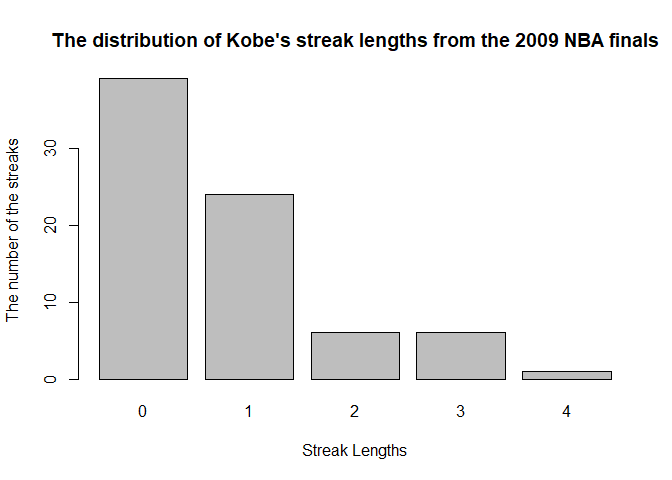
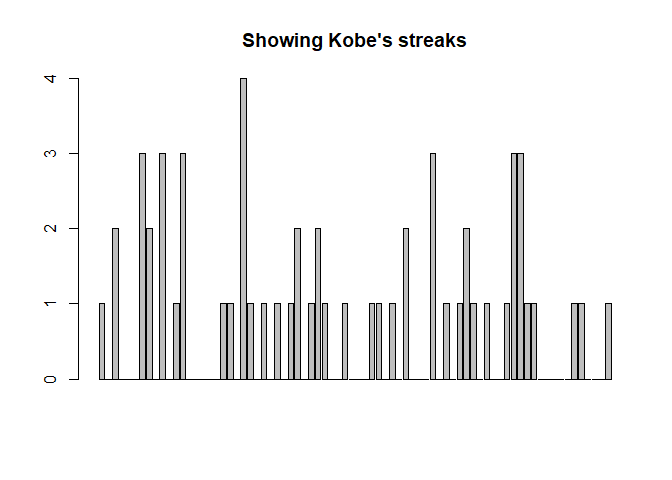
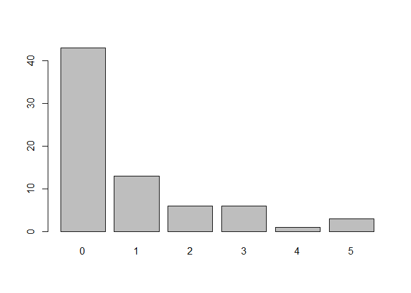
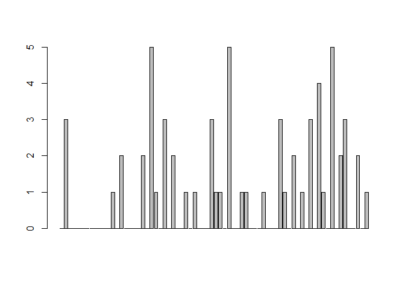

Basketball (Kobe) Data Analysis
================
Saeah Go
April 20, 2021

## Objectives for this project

1.  **R Programming Objectives**

-   Practice subsetting
-   Using loops
-   Creating your own functions
-   Working with data frames in R

2.  **Statistics Objectives **

-   Think about *statistical independence*
-   Obtain frequencies from categorical data
-   Obtain conditional probabilities with real data
-   Learn how to simulate data under particular assumptions and derive
    meaningful inference from it

Basketball players who make several baskets in succession are described
as having a *hot hand*. Fans and players have long believed in the hot
hand phenomenon, which refutes the assumption that each shot is
independent of the next. However, a 1985 paper by Gilovich, Vallone, and
Tversky collected evidence that contradicted this belief and showed that
successive shots are independent events
(<http://psych.cornell.edu/sites/default/files/Gilo.Vallone.Tversky.pdf>).
This paper started a great controversy that continues to this day, as
you can see by Googling *hot hand basketball*.

Our investigation will focus on Kobe Bryant’s performance with the Los
Angeles Lakers in the 2009 NBA finals when playing against the Orlando
Magic, which earned him the title *Most Valuable Player*. Many
spectators commented on him having a *hot hand*. Let’s load some data
from those games and look at the data structure with `str`.

<div style="small">

``` r
load("kobe.RData")
str(kobe)
```

    ## 'data.frame':    133 obs. of  7 variables:
    ##  $ vs         : Factor w/ 1 level "ORL": 1 1 1 1 1 1 1 1 1 1 ...
    ##  $ game       : int  1 1 1 1 1 1 1 1 1 1 ...
    ##  $ quarter    : Factor w/ 5 levels "1","1OT","2",..: 1 1 1 1 1 1 1 1 1 3 ...
    ##  $ time       : Factor w/ 116 levels "00:00.0","00:00.5",..: 114 109 102 100 96 85 64 21 11 91 ...
    ##  $ description: Factor w/ 80 levels "Bryant 3pt Shot: Made (16 PTS) Assist: Bynum (1 AST)  ",..: 40 78 75 27 44 78 52 62 79 45 ...
    ##  $ basket     : chr  "H" "M" "M" "H" ...
    ##  $ shot.num   : num  1 2 1 1 2 3 1 1 1 1 ...

</div>

In this data frame, each row contains a shot taken by Kobe Bryant. If he
hit the shot (made a basket), a hit, `H`, is recorded in the column
named `basket`, otherwise a miss, `M`, is recorded.

Just looking at the string of hits and misses, it can be difficult to
gauge whether or not it seems like Kobe was shooting with a hot hand.
One way we can approach this is by considering the belief that hot hand
shooters tend to go on shooting streaks. For this lab, we define the
length of a shooting streak to be the *number of consecutive baskets
made until a miss occurs*.

For example, in Game 1 Kobe had the following sequence of hits and
misses from his nine shot attempts in the first quarter:

\[ \]

To verify this use the following command:

``` r
kobe$basket[1:9]
```

Within the nine shot attempts, there are six streaks, which are
separated by a “\|” above. Their lengths are one, zero, two, zero, zero,
zero (in order of occurrence).

### Question 1

Think about what a streak of length 0, length 1, length 2, etc. mean
(i.e. how many hits and misses are in a streak of length
*m* = 0, 1, 2, …). Using as input the variable or variables from the
`kobe` data that you consider necessary, build the function
`get_streak`, which returns the length of each streak.

``` r
##Build the function get_streak
get_streak <- function(shot)
{
    if (!is.atomic(shot))
        shot = shot[,1]

    if (any(!shot %in% c("H","M"))) # if input(x) is not "H" or "M"
        stop('Error: Input should be either hits ("H") or misses ("M")')
    
    a = rep(0,length(shot)) # initialize rep(repetition) function: create the shot length's number of zeros
    a[shot == "H"] = 1 # basket results: replace from 0 to 1 if x value is hit("H")
    a = c(0, a, 0) # add zeros before y and after y to calculate streak
    num_of_miss = which(a == 0)
    streak = diff(num_of_miss) - 1 # diff(num_of_miss) = the number of shoots (hit + miss) per streak (remember that the first and the last is the zeros we put in line 85)
    streak_list = data.frame(streak) # create data frame
    return(streak_list)
}
kobe_streak = get_streak(kobe$basket)

# Use summary, quantile, and barplot to describe the distribution of Kobe's streak lengths from the 2009 NBA finals
summary(kobe_streak$streak)
```

    ##    Min. 1st Qu.  Median    Mean 3rd Qu.    Max. 
    ##  0.0000  0.0000  0.0000  0.7632  1.0000  4.0000

``` r
quantile(kobe_streak$streak)
```

    ##   0%  25%  50%  75% 100% 
    ##    0    0    0    1    4

``` r
kobe_streak_list <- table(kobe_streak)
barplot(kobe_streak_list, main = "The distribution of Kobe's streak lengths from the 2009 NBA finals", xlab = "Streak Lengths", ylab = "The number of the streaks")
```

<!-- -->

``` r
barplot(kobe_streak$streak, main = "Showing Kobe's streaks")
```

<!-- -->

Now, use your function `get_streak` to calculate the lengths of all
shooting streaks and then use the R functions `summary`, `quantile` and
`barplot` to describe the distribution of Kobe’s streak lengths from the
2009 NBA finals (use `?` to find out about their usage). What was his
typical streak length? How long was his longest streak of baskets?

> To describe the distribution of Kobe’s streak lengths from the 2009
> NBA finals, we can use the barplots we got. I made two barplots, the
> first one shows how many streaks of length zero, one, two, three and
> four during the game. The second barplot shows the streaks in the
> game. The first graph named “The distribution of Kobe’s streak lengths
> from the 2009 NBA finals” is right-skewed(positive skewness). Through
> the quantile function, I could see that Q1 is zero and Q3 is 1. Thus
> IQR is Q3-Q1 = 1-0 which is 1.

> We can find his typical streak length by getting the median value.
> Since the median is zero, the typical length of a streak is zero. When
> we see the first barplot titled The distribution of Kobe’s streak
> lengths, there are five columns, from zero to four. Each column
> denotes the number of shoots in each streak. So his longest streak of
> baskets was four, it means that he at most hit four times in a row. In
> other words, the longest streak is 4. The distribution is right skewed
> with a range of 0 to 4.

### Question 2

So Kobe had some long shooting streaks, but are they long enough to
support the belief that he had *hot hands*? What can we compare them to?
Consider the idea of *statistical independence*. A shooter with a hot
hand will have shots that are *not* independent of one another.
Specifically, if the shooter makes their first shot, the hot hand model
says they will have a *higher* probability of making their second shot.

During Kobe’s career, the percentage of time he makes a basket (i.e. his
shooting percentage) is about 45%, or equivalently \[ P() = 0.45. \] If
hot hands is really a thing, then when Kobe makes the first shot and has
a hot hand (*not* independent shots), then the probability that he makes
his second shot would go up to, let’s say, 60%, \[ P( , \| , ) = 0.60.
\] Because of these increased probabilites, you’d expect Kobe to have
longer streaks. Now, if *hot hands* are just a myth, and each shot is
independent of the next. When Kobe hits his first shot, the probability
that he makes the second is still 0.45. \[ P( , \| , ) = 0.45. \]

Now, having expressed the problem in this way we may assess if Kobe’s
shooting streaks are long enough to indicate that he has hot hands. Here
are two possible ways: 1) calculating the conditional probabilities and
2) comparing Kobe’s streak lengths to someone without hot hands (a
simulated independent shooter).

#### Part 2.a – Conditional probabilities

1.  With the data, a logical statement, and the function `mean`, first
    calculate the total percentage of shots that resulted in a basket in
    the 2009 NBA finals, as \[\]

``` r
num_hits = 0
i = 1 # counter
total_shots = nrow(kobe) # the number of total shots
# In the loop, get the number of hits
for(i in 1:nrow(kobe_streak)){
    if(!(mean(kobe_streak[[i, "streak"]]) == 0)){
        num_hits = num_hits + kobe_streak[[i, "streak"]] 
    }
}
prob = num_hits/total_shots # calculate the probability
pct <- round(prob * 100, 2) # get the percentage with rounded
print(paste(pct, "%")) 
```

    ## [1] "43.61 %"

2.  We need to filter out the streaks that had at least the first shot
    resulting in a Hit – by doing this we are conditioning the data to
    make the conditional statement. Since those streaks in which Kobe
    made the first shot have two shots or more, use the variable
    “shot.num” in the dataset to calculate
    $$P(\\text{shot 2 = H} \\, \| \\, \\text{shot 1 = H})=\\frac{\\\# (\\text{shot 2 = H} \\cap \\text{shot 1 = H)}}{ \\\# (\\text{shot 2 = H} \\cup \\text{shot 2 = M})}=\\frac{\\\# \\text{shot 2 = H}}{ \\\# \\text{ shot 2}}$$
    by identifying those observations corresponding to the second shots
    (i.e., those with “shot.num==2”).

``` r
# We should figure out first what does P(shot 2 = H | shot 1 = H) means. It means what is the probability that Kobe hits in his second shot in a streak given that the first shot was hit. We should aware that when second shot is hit(H), the shot.num should be bigger than 2 (so, 3, 4, or 5). Similarly, first shot will be hit if shot.num is 2,3,4, or 5. Thus the conditional probability we need to get is the same as n(shot.num is 3,4,5)/n(shot.num is 2,3,4,5). 

# Initialize the values
shot.2=0
shot.3=0
shot.4=0
shot.5=0

for(i in 1:nrow(kobe)){
    if(kobe[i,]$shot.num == 1){
        next
    } else{
        if(kobe[i,]$shot.num == 2){
            shot.2 = shot.2 + 1
        }else if(kobe[i,]$shot.num == 3){
            shot.3 = shot.3 + 1
        }else if(kobe[i,]$shot.num == 4){
            shot.4 = shot.4 + 1
        }else{
            shot.5 = shot.5 + 1
        }
    }
}
cond_prob <- round(((shot.3+shot.4+shot.5)/(shot.2+shot.3+shot.4+shot.5)) * 100, 2)
print(paste(cond_prob, "%"))
```

    ## [1] "36.84 %"

3.  Is there evidence to think that Kobe has *hot hands*? How reliable
    is this conclusion? Provide an objective argument to justify your
    answer.

> The calculation we get in the above question, P(shot 2 = H\|shot 1 =
> H) means what is the probability that shot 2 is hit when given shot 1
> is hit. In other words, it means tat what is the probability that Kobe
> success the second hit when we know his first shot was hit in a
> streak. We got approximately 0.36(36%) for the conditional
> probability, and we got 43.61% for the probability that Kobe shots
> hit. We could know that the conditional probability we get is less
> than the probability that Kobe shots hit(Part 2.a.1). This means Kobe
> less likely gets a hit(H) in his second shot. Thus this gives reliable
> conclusion that the conditional probability above supports that hot
> hand theory is not real.

#### Part 2.b – Simulating independent shooters

The second alternative is to compare Kobe’s streak lengths to the streak
lengths of shooters without hot hands, or in other words to independent
shooters. We don’t have any data from shooters we know to have
independent shots, but this type of data is very easy to simulate in R.
In a simulation, you set the ground rules of a random process and then
the computer uses random numbers to generate an outcome that adheres to
those rules. To simulate a single shot from an independent shooter with
a shooting percentage of 50% we can use the code below (switch the chunk
option `eval=FALSE` to `eval=TRUE` so that this chunk is evaluated).

``` r
outcomes <- c("H", "M")
sample(outcomes, size = 1, replace = TRUE, prob = c(0.5,0.5))
```

    ## [1] "M"

*Keep in mind that to make a valid comparison between Kobe and our
simulated independent shooter, we need to align both their shooting
percentage and the number of attempted shots.*

If you want to learn more about `sample` or any other function, recall
that you can always check out its help file.

``` r
?sample
```

Work on the following problems:

1.  Simulate 133 shots from an independent shooter *comparable* to Kobe
    and using `calc_streak`, compute the streak lengths of this
    independent shooter.

``` r
sample_streak <- sample(outcomes, size = 133, replace = TRUE, prob = c(0.5,0.5)) # simulate 133 shots from an independent shooter
a_shooter_streak <- get_streak(sample_streak)
```

2.  Use the R functions `table` and `quantile` to compare the streak
    length distribution of Kobe and that for this independent shooter

``` r
# Used the function 'table'
table(kobe_streak)
```

    ## kobe_streak
    ##  0  1  2  3  4 
    ## 39 24  6  6  1

``` r
table(a_shooter_streak)
```

    ## a_shooter_streak
    ##  0  1  2  3  4  5 
    ## 43 13  6  6  1  3

``` r
# Used the function 'quantile'
quantile(kobe_streak$streak)
```

    ##   0%  25%  50%  75% 100% 
    ##    0    0    0    1    4

``` r
quantile(a_shooter_streak$streak)
```

    ##   0%  25%  50%  75% 100% 
    ##    0    0    0    1    5

3.  Build the R function `sim_generation`, which takes the number of
    independent shooters (*N*) to simulate, the number of shots taken by
    each shooter (*m*), and the shooting percentage (*p**e**r**c*); and
    returns a data frame containing the outcomes for all shot taken by a
    single shooter in each row.

``` r
sim_generation <- function(N, m, perc){
    df <- data.frame("Shooters" = c(), "Shots" = c()) # create a data frame
    i = 1 # a counter
    for(i in 1:N){
        shots <- c()
        for(j in 1:m){
            shots <- c(shots, sample(outcomes,size=1, replace=TRUE, prob = c(perc, 1-perc)))
        }
        temp_df <- data.frame("Shooters" = i, "Shots" = shots) # temporary data frame
        df <- rbind(df, temp_df) # update the data frame
    }
    return(df)
}
```

4.  Use the function `sim_generation` to simulate *N* = 500 shooters
    taking *m* = 133 shots and *p**e**r**c* = 0.45.

``` r
simulation <- sim_generation(500, 133, 0.45)
```

5.  Get creative, use the results from the previous exercise to evaluate
    if Kobe has in fact hot hands. For this you may use any R function
    of your choice, some options are `quantile`, `mean`, `median`,
    `histogram`, `barplot`.

``` r
summary(simulation)
```

    ##     Shooters        Shots          
    ##  Min.   :  1.0   Length:66500      
    ##  1st Qu.:125.8   Class :character  
    ##  Median :250.5   Mode  :character  
    ##  Mean   :250.5                     
    ##  3rd Qu.:375.2                     
    ##  Max.   :500.0

``` r
quantile(a_shooter_streak$streak)
```

    ##   0%  25%  50%  75% 100% 
    ##    0    0    0    1    5

``` r
a_shooter_list <- table(a_shooter_streak)
barplot(a_shooter_list)
```

<!-- -->

``` r
barplot(a_shooter_streak$streak)
```

<!-- -->

> In this problem, our goal was comparing Kobe’s streak lengths and the
> samples(random shooters)’ streak lengths. We assumed that the
> samples(random shooters) do NOT have hot hands. As we could see
> through the graphs above, the distributions of the samples appear
> similar in shape. Kobe’s biggest streak length was four, and the
> sample’s biggest streak length is five. Kobe had one streak of length
> 4 whereas a random shooter had more than one streak of length 4. So
> this is contradiction, we cannot conclude that Kobe has hot hands.

<div id="license">

OpenIntro, which is released under a [Creative Commons
Attribution-ShareAlike 3.0
Unported](http://creativecommons.org/licenses/by-sa/3.0).

</div>
