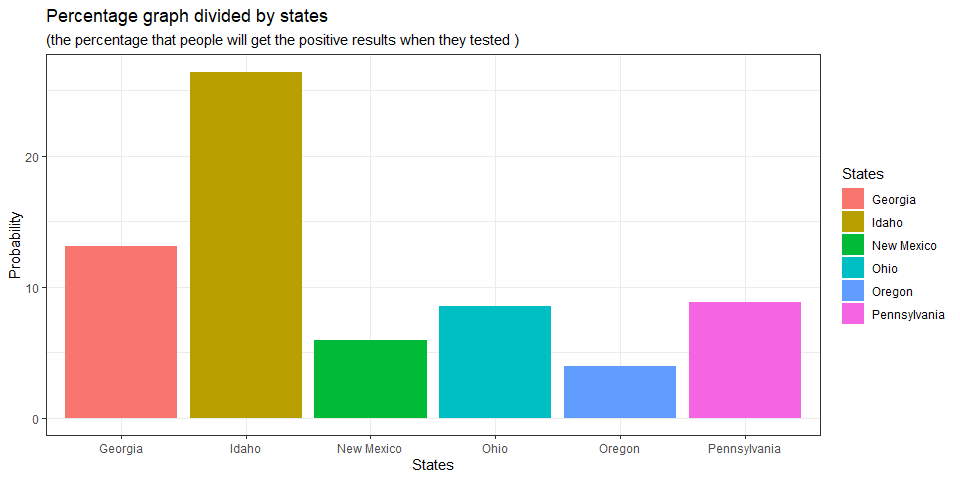

Covid-19 Data Analysis
================
Saeah Go
May 26, 2021

# General Information and Load Data

## General Information

-   I used block quote for my questions, observations, and longer
    comments before and after solving each question.
-   Note that I summarized all the questions for not making codes long.

## Import Data

Here is the data:

``` r
#confirmed COVID-19 time series cases US (trimmed to include from 11/01/2020 to 05/12/2021)
covid.usa.ts.confirmed <- read_csv('https://raw.githubusercontent.com/CSSEGISandData/COVID-19/master/csse_covid_19_data/csse_covid_19_time_series/time_series_covid19_confirmed_US.csv') %>% select(c(1:11,296:488))

#Confirmed COVID-19 time series deaths US (trimmed to include from 11/01/2020 to 05/12/2021)
covid.usa.ts.deaths <- read_csv('https://raw.githubusercontent.com/CSSEGISandData/COVID-19/master/csse_covid_19_data/csse_covid_19_time_series/time_series_covid19_deaths_US.csv') %>% select(c(1:12,297:488))

#Daily data summary by state for 05-12-2021
covid.usa.daily <- read_csv("https://raw.githubusercontent.com/CSSEGISandData/COVID-19/master/csse_covid_19_data/csse_covid_19_daily_reports_us/05-12-2021.csv") 

#US vaccinated people data
vacc.people <- read_csv("https://raw.githubusercontent.com/govex/COVID-19/master/data_tables/vaccine_data/us_data/time_series/people_vaccinated_us_timeline.csv")

#mask use data
maskuse <- read_csv("https://raw.githubusercontent.com/nytimes/covid-19-data/master/mask-use/mask-use-by-county.csv")
```

# Part 1: Wrangling the COVID-19 time series data

1.  Identify and list the *primary and foreign keys* for each data
    frame.

-   covid.usa.daily:  
    -   primary key: Province\_State (I had Province\_State, FIPS, and
        UID as candidate keys, and I chose Province\_State)  
    -   foreign key:  
        Province\_State in covid.usa.ts.confirmed  
        Province\_State in covid.usa.ts.deaths  
        Province\_State in vacc.people  
        No direct relationship with maskuse

------------------------------------------------------------------------

-   covid.usa.ts.confirmed  
    -   primary key: UID (I had UID, Lat, Long\_, and Combined\_Key as
        candidates, and I chose UID)  
    -   foreign key:  
        UID in covid.usa.daily  
        UID in covid.usa.ts.deaths  
        No direct relationship with maskuse  
        No direct relationship with vacc.people

------------------------------------------------------------------------

-   covid.usa.ts.deaths  
    -   primary key: UID (I had UID, Lat, Long\_, and Combined\_Key as
        candidates, and I chose UID)  
    -   foreign key:  
        UID in covid.usa.daily  
        UID in covid.usa.ts.confirmed  
        No direct relationship with maskuse  
        No direct relationship with vacc.people

------------------------------------------------------------------------

-   maskuse  
    -   primary key: COUNTYFP (I had COUNTYFP as a candidate key, so
        primary key is COUNTYFP. The columns NEVER, RARELY, SOMETIMES,
        FREQUENTLY, and ALWAYS values can be duplicated, so they cannot
        be primary key.)  
    -   foreign key:  
        No direct relationship with covid.usa.daily  
        FIPS in covid.usa.ts.confirmed  
        FIPS in covid.usa.ts.deaths  
        FIPS in vacc.people

------------------------------------------------------------------------

-   vacc.people
    -   primary key: The dataset does not have a primary key. All
        variables do not uniquely identify an observation or have NULL
        value(s). I can have compound keys, but not primary key for this
        data
    -   foreign key: Since there are no primary keys, a foreign key is
        also not available.


2.  Using `covid.usa.ts.confirmed` and `covid.use.ts.deaths`, reshape
    them into long format to generate a single new data frame with the
    daily time series **BY STATE** including both number of confirmed
    cases and deaths.

``` r
# reshape covid.usa.ts.confirmed
confirmed_cases <- covid.usa.ts.confirmed %>%
  select(-(UID : Admin2), -(Country_Region : Combined_Key)) %>% # remove unnecessary columns
  group_by(Province_State) %>%
  summarise_if(is.numeric, list(~sum(.))) %>% # calculate the total confirmed cases
  gather("Date", "Confirmed_Cases", 2:194) 

# reshape covid.usa.ts.deaths
death_cases <- covid.usa.ts.deaths %>%
  select(-(UID : Admin2), -(Country_Region : Population)) %>%
  group_by(Province_State) %>% 
  summarise_if(is.numeric, list(~sum(.))) %>% # calculate the total death cases
  gather("Date", "Death_Cases", 2:193)

# create a new data frame by combining the two data frames (used full_join for this)and name it covid.usa.states.us
covid.usa.states.ts <- confirmed_cases %>% 
  full_join(death_cases, by = c("Province_State", "Date"))

# convert to a 'Date-Time' type variable by using lubridate::mdy()
covid.usa.states.ts$Date <- lubridate::mdy(covid.usa.states.ts$Date)
```

3.  Append to `covid.usa.states.ts` all of the information in
    `vacc.people`

``` r
# append vacc.people to covid.usa.states.ts by using full_join
covid.usa.states.ts <- covid.usa.states.ts %>%
  full_join(vacc.people, by = c("Province_State", "Date")) 
```

# Part 2: Let’s use the data

1.  Using `covid.usa.daily` select *3 highly impacted states*, *3 mildly
    impacted states* by COVID-19, where by ‘highly impacted’ I mean the
    states with high numbers of confirmed cases.

``` r
# select three highly impacted states
highly_3 <- covid.usa.daily %>% 
  arrange(desc(Confirmed)) %>% # reorder Confirmed column from highest to lowest
  slice(6:8)

# select three mildly impacted states
# (I wanted to include Oregon, so that's why I chose rows 21:23)
mildly_3 <- covid.usa.daily %>%
  arrange(Confirmed) %>% # reorder Confirmed column from lowest to highest
  slice(21:23)
```

    ## 3 highly impacted states are: Pennsylvania, Georgia, Ohio

    ## 3 mildly impacted states are: Idaho, Oregon, New Mexico

2.  Create a visualization of the evolution of confirmed cases, deaths,
    and people vaccinated for each of the 6 states identified as
    *highly* and *mildly* impacted (use the `covid.usa.states.ts`
    data.frame to create the figure).

> Note that I added vis\_ to the variable names in this question since I
> used all of these variables for the visualization.

``` r
# use the six states picked above and to arrange data
vis_data <- covid.usa.states.ts %>%
  filter(Province_State == "Pennsylvania" | Province_State == "Georgia" | 
           Province_State == "Ohio" | Province_State == "Idaho" | 
           Province_State == "Oregon" | Province_State == "New Mexico") 

# when I reorder the states using facter(), then I can layout three highly impacted states in the first row and three mildly impacted states in the second row
vis_data$Province_State <- factor(vis_data$Province_State, 
                                  levels = c("Pennsylvania", "Georgia", "Ohio", # re-level
                                             "Idaho", "Oregon", "New Mexico"))

# data organizing to create a graph
vis_data <- vis_data[!is.na(vis_data$Confirmed_Cases) & 
                       !is.na(vis_data$Death_Cases) & 
                       !is.na(vis_data$People_Fully_Vaccinated),]

# create graph
ggplot(data = vis_data) + 
  geom_line(aes(x = Date, y = Confirmed_Cases, color = "Confirmed")) + 
  geom_line(aes(x = Date, y = People_Fully_Vaccinated, color = "Fully Vaccinated")) + 
  geom_line(aes(x = Date, y = Death_Cases, color = "Death")) + 
  ggtitle("Covid-19 Graph") + 
  xlab("Date") + ylab("Confirmed Cases") +
  theme_bw() +
  facet_wrap(Province_State~., scales = "free") +
  theme(legend.position = "right",
        plot.title = element_text(size = 15), #adjust the title size
        plot.subtitle=element_text(size = 13, 
                                   face = "italic", 
                                   color = "black")) + # adjust the subtitle size
  labs(subtitle = "(compares the number of confirmed cases, death cases, and the number of people get fully vaccinated)") + # added subtitle
  scale_color_manual(name = "Cases", 
                     values = c("Confirmed" = "darkgreen", 
                                "Fully Vaccinated" = "blue", 
                                "Death" = "red"))
```

<!-- -->

> Since the number of death cases range is small compare to the other
> two data, I can’t see any helpful information with death cases in the
> graph above. So I created a graph only with death cases data

``` r
ggplot(data = vis_data) +
  geom_line(aes(x = Date, y = Death_Cases, color = "red")) +
  ggtitle("Covid-19 Death Cases Graph") + 
  xlab("Date") + ylab("Confirmed Cases") +
  theme_bw() +
  facet_wrap(Province_State~., scales = "free") +
  theme(legend.position = "right",
        plot.title = element_text(size = 15)) + 
  scale_color_discrete(name = "Cases", labels = "Death") 
```

<!-- -->

### Observation

> With the graphs above, we could see that the slopes every states
> decreased in March as vaccination started. The decrease of the slope
> means the new death cases occurrence was decreased, which is good. The
> vaccination graph have mostly exponential form, but Georgia’s
> vaccination speed sharply increased in the beginning of April.

3.  Do you see any interesting change in the trajectories of the
    corresponding time series for the number of cases and deaths taking
    place with vaccinations? Produce **meaningful** summaries that
    enable you to quantify this change (e.g., average number of new
    cases in windows of 90 days before vs 90 days after vaccination
    started). One or two summary measures is good. Make either a table
    or a figure to display your findings and comment on them.

> I want to compare the average number of new cases in windows of 90
> days before and 90 days after vaccination started. Since every state’s
> vaccination starting date is different, I chose to consider Oregon
> only. Since Oregon’s vaccination start date is 01-04-2021, 04-04-2021
> is after 90 days, and 10-06-2020 is before 90 days. I included the
> date 01-04-2021 when I calculate before and after 90 days. Since the
> column *Confirmed* shows aggregated case count for the state, I can
> get total cases for 90 days before vaccination by subtracting the
> number of cases in 2020-10-06 from the number of cases in 2021-01-04.
> Similarly, I can get total cases for 90 days after the vaccination by
> subtracting 2021-01-04 from 2021-04-04.

``` r
# daily data summary by state for 01-04-2021
vacc_start_date <- read_csv("https://raw.githubusercontent.com/CSSEGISandData/COVID-19/master/csse_covid_19_data/csse_covid_19_daily_reports_us/01-04-2021.csv") %>% 
  filter(Province_State == "Oregon") %>% 
  select(Confirmed)

# daily data summary by state for 04-04-2021
after_90_days <- read_csv("https://raw.githubusercontent.com/CSSEGISandData/COVID-19/master/csse_covid_19_data/csse_covid_19_daily_reports_us/04-04-2021.csv") %>% 
  filter(Province_State == "Oregon") %>% 
  select(Confirmed)

# daily data summary by state for 10-06-2020
before_90_days <- read_csv("https://raw.githubusercontent.com/CSSEGISandData/COVID-19/master/csse_covid_19_data/csse_covid_19_daily_reports_us/10-06-2020.csv") %>% 
  filter(Province_State == "Oregon") %>% 
  select(Confirmed)

# calculate the number of new cases 90 days before and after the vaccination start date
total_before_90_days <- as.numeric(vacc_start_date - before_90_days)
total_after_90_days <- as.numeric(after_90_days - vacc_start_date)

# calculate mean
mean_before_90_days <- total_before_90_days/90
mean_after_90_days <- total_after_90_days/90

# create a data frame
comparison_90 <- data.frame(days = c("before 90 days", "after 90 days"),
                 cases_90 = c(total_before_90_days, total_after_90_days),
                 mean_90 = c(mean_before_90_days, mean_after_90_days)) 

# create a graph
ggplot(data = comparison_90) + 
  geom_col(aes(x = days, y = cases_90, fill = cases_90), position = "dodge") + 
  geom_col(aes(x = days, y = mean_90, fill = mean_90), position = "dodge") +
  coord_flip() + # switch x and y axes each other
  ggtitle("Confirmed Cases Comparision") +
  xlab("Before and after vaccination") + ylab("Total cases and their average") + 
  theme_bw() +
  labs(subtitle = "(90 days before and after vaccination)") + # added subtitle
  scale_fill_continuous(name = "The number\nof cases") # legend name
```

<!-- -->

    ## Average number of new cases in windows of 90 days before is: 923.49 
    ## Average number of new cases 90 days after vaccination started is: 538.1

### Summary

> Before starting the vaccination, we could see that there are
> approximately 924 cases. And we have about 538 cases after starting
> the vaccination, which denotes the number of new cases is 538.1/923.49
> = 0.5826 ≈ 58% decreased. I could check this through the graph that
> its sum of confirmed cases after 90 days is much smaller than before
> 90 days. Also, the average number of cases after 90 days is a little
> smaller than the average number of cases before 90 days.

4.  Using information from the `maskuse` data explore if mask use seems
    to correlate with your selected states being mildly or highly
    impacted.

> I use my six selected states being mildly and highly impacted.

``` r
# since maskuse$COUNTYFP is character type, I need to convert the column type to numeric first
maskuse$COUNTYFP <- as.numeric(maskuse$COUNTYFP)

# combine data by using left_join
confirmed_cases_mask <- covid.usa.ts.confirmed %>%
  select(-(UID:code3), -Admin2, -(Country_Region:Combined_Key)) %>% # remove unnecessary columns
  filter(Province_State == c("Pennsylvania", "Georgia", "Ohio", "Idaho", "Oregon", "New Mexico")) %>% # pick rows of six selected states above
  gather("Date", "Confirmed_Cases", 3:195) %>% 
  group_by(FIPS, Province_State) %>%
  summarise(Confirmed_Cases = sum(Confirmed_Cases)) %>% # calculate the total confirmed cases
  left_join(maskuse, by = c("FIPS" = "COUNTYFP"))

# re-order the dataset "confirmed_cases_mask"
sorted_cases <- confirmed_cases_mask[order(confirmed_cases_mask$Confirmed_Cases, decreasing = TRUE),] 

# set colors by the number of confirmed cases 
col.cases <- rep(c("red", "orange", "yellow", "green"), 
               times=c(sum(sorted_cases$Confirmed_Cases > 2000000), # extremely high risk (over 2M), red
                       sum(sorted_cases$Confirmed_Cases >= 500000 & sorted_cases$Confirmed_Cases < 1999999), # high risk (over 500K less than 2M), orange
                       sum(sorted_cases$Confirmed_Cases >= 100000 & sorted_cases$Confirmed_Cases < 499999), # moderate risk (over 100K less than 500K), yellow
                       sum(sorted_cases$Confirmed_Cases>=0 & 
sorted_cases$Confirmed_Cases < 99999))) # low risk (less than 100K), green
                       
# create a graph using "NEVER" column
plot(y = sorted_cases$Confirmed_Cases, x = sorted_cases$NEVER,
     ylab = "Confirmed Cases", xlab = "NEVER",
     main = "Relationship between the number of confirmed cases \n and probability of people of NEVER wearing masks",
     cex.main = 1,
     cex = 1, 
     col = col.cases,
     type = "p",
     pch = 16,
     lty = 1,
     lwd = 1)
     
legend("topright", 
       bty = "y", # made box for legend 
       pch = c(16,16,16,16),
       col = c("red", "orange", "yellow", "green"), 
       legend = c("Confirmed Cases > 2000000",
                  "500000 <= Confirmed Cases < 1999999", 
                  "100000 <= Confirmed Cases < 499999", 
                  "Confirmed Cases >= 0"))
```

<!-- -->

``` r
# create a graph using "ALWAYS" column
plot(y = sorted_cases$Confirmed_Cases, x = sorted_cases$ALWAYS,
     ylab = "Confirmed Cases", xlab = "ALWAYS",
     main = "Relationship between the number of confirmed cases \n and probability of people of ALWAYS wearing masks",
     cex.main = 1,
     cex = 1, 
     col = col.cases,
     type = "p",
     pch = 16,
     lty = 1,
     lwd = 1)

legend("topright", 
       bty = "y", 
       pch = c(16,16,16,16),
       col = c("red", "orange", "yellow", "green"), 
       legend = c("Confirmed Cases > 2000000",
                  "500000 <= Confirmed Cases < 1999999", 
                  "100000 <= Confirmed Cases < 499999", 
                  "Confirmed Cases >= 0"))
```

<!-- -->

### Observation

> I could see that counties with high risks have higher probabilities of
> people wearing masks ALWAYS. Also, I could find that those counties
> have lower probabilities of people NEVER wearing masks. I could assume
> that it’s because there are higher cases, which means higher risks
> made people wear masks than other counties.

5.  Formulate and explore ONE question about the 3 highly and 3 mildly
    affected states with any of the datasets I have provided, or by
    using the policy tracker datasets corresponding to your states.

### My Question

> I use the datasets highly\_3 and mildly\_3, which are extracted from
> the data set covid.usa.daily. While I’m looking at the dataset, I
> wondered what would be the probability that people get positive
> results when tested. So I will get the probability for each state and
> find out which state has the highest rate.

``` r
# calculate the probability
affected_6_states <- union(highly_3, mildly_3) %>% # combine highly_3 and mildly_3
  mutate(Pos_Prob = Confirmed/Total_Test_Results * 100) # calculate the percentage that people get positive results when tested for each state 
  
# create graph
ggplot() +
  geom_col(data = affected_6_states,
           aes(x = Province_State, y = Pos_Prob,
               fill = Province_State)) +
  xlab("States") + ylab("Probability") +
  ggtitle("Percentage graph divided by states") +
  theme_bw() +
  labs(subtitle = "(the percentage that people will get the positive results when they tested )") + # added subtitle 
  scale_fill_discrete(name = "States") # legend name
```

<!-- -->

> As we could see through the graph, Idaho is the highest probability
> state, and the probability is over 25%. Before exploring, I expected
> that the highest state would be in Georgia, Ohio, or Pennsylvania
> since those are the counties with higher cases. I thought it has a
> higher probability to get positive if a city is crowded. But unlike my
> expectation, Idaho has the highest probability.
