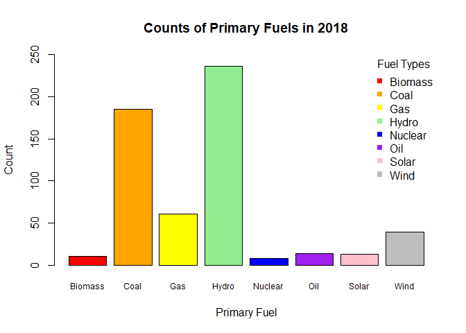
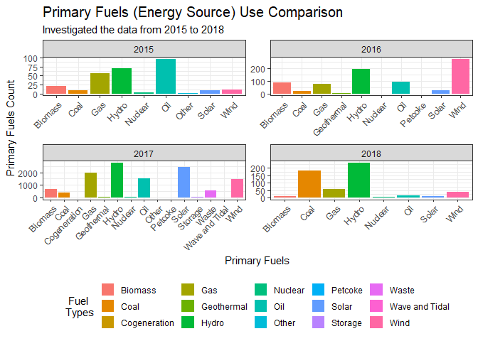

Energy Data Analysis
================
Saeah Go
May 6th, 2021

# General Information

-   I used block quote for my questions(hypothesis) and observations
-   Between my base R plot and ggplot plot, I have a code chunk which
    rearrange power data, especially to remove *NA*s in
    year\_of\_capacity\_data. But I hide this code chunk by using
    `echo = FALSE`, just because it’s fun and professor wanted to use
    those options. I’m just writing this just in case you might wonder
    how the code works
-   I appreciate if you tell your observations that I couldn’t figure
    out in the feedback!

# Import Data

Load the data using read.csv

``` r
power <- read.csv('C:/Users/Saeah Go/OneDrive/Desktop/Projects/Dataset/global_power_plant_database.csv',
                  na.strings = c(NA,"","NA"),
                  header=T)
```

# My question or hypothesis

> For my base R plot, I want to explore which energy source is used at
> most as primary fuels for each company, especially in 2018. I will
> figure out what are the first, second, third energy sources. My
> hypothesis is that renewable energies, for example, solar, wind,
> biomass, etc., will occur in second or third place because those are
> the energies people prefer regarding environmental issues. But note
> that since I just count the number of primary fuels each company
> rather than measuring the quantity of those energy fuels, the highest
> energy source does not denote that the source is the most energy
> produced.

> Similarly, with the ggplot plot, I explored the same thing. But in
> this case, I compared them each year from 2015 to 2018. There were
> more data before 2015, but before then there were not many fuels, only
> like Biomass, Hydro, and Solar energies, unlike there are various
> energy sources after 2015. So I thought comparing all years has no
> meaning. Thus I decided to analyze only the data with 2015, 2016,
> 2017, and 2018.

# My base R plot

My base R plot

``` r
# pick rows with year of capacity data is 2018
power_2018 <- power[(power$year_of_capacity_data == 2018),] 

# convert imported data to factors
power_2018 <- factor(power_2018$primary_fuel) 

# create a plot
plot(x = power_2018, 
     cex.names = 0.75, # reduced the x axis labels' size
     xlab = "Primary Fuel", ylab = "Count",
     main = "Counts of Primary Fuels in 2018",
     col = c("red", "orange", "yellow", "lightgreen", "blue", "purple", "pink", "gray"),
     ylim = c(0,250)) # y-range is: 0-250

# manage legend
legend("topright",
       title ="Fuel Types", # legend title
       bty="n", # no box created
       pch=c(15,15,15,15,15,15,15,15),
       col=c("red", "orange", "yellow", "lightgreen", "blue", "purple", "pink", "gray"),
       legend = c("Biomass", "Coal", "Gas", "Hydro", "Nuclear", "Oil", "Solar", "Wind"))
```

<!-- -->

## Observation

> I could see that Hydro is the most energy source that each company
> chose as the primary fuel in 2018. I expected Wind or Solar energy
> would take second place because those are called eco-friendly energy
> sources, and the government encourages using those energies. But
> unlike my expectation, the second primary fuel was Coal, and the third
> one was Gas.

# My `ggplot` plot

## My ggplot plot code

``` r
# pick the rows with year of capacity data is 2015, 2016, 2017, and 2018.
power_data <- subset(power,
                     year_of_capacity_data == 2015 |
                     year_of_capacity_data == 2016 |
                     year_of_capacity_data == 2017 |
                     year_of_capacity_data == 2018)

# create the barplot
ggplot(data = power_data, aes(x=primary_fuel, fill = primary_fuel)) +
  geom_bar() + 
  xlab("Primary Fuels") + ylab("Primary Fuels Count") + 
  ggtitle("Primary Fuels (Energy Source) Use Comparison") +
  theme_bw() +
  facet_wrap(year_of_capacity_data~., scales = "free") +
  theme(axis.text.x = element_text(angle = 45, hjust = 1),
        legend.position = "bottom",
        plot.title = element_text(size = 15)) + # adjust the title size
  labs(subtitle = "Investigated the data from 2015 to 2018") + # added subtitle
  guides(group = "none",
         fill = guide_legend(override.aes=list(size = 2), ncol = 5)) +
  scale_fill_discrete(name = " Fuel\nTypes") # legend name
```

<!-- -->

## Observation

> In 2015, Oil, Hydro, and Gas were the highest three fuels. In 2016,
> Wind, Hydro, and Biomass were the top three. In 2017, Hydro, Solar,
> and Gas were the most primary fuels. And in 2018, Hydro, Coal, and Gas
> are the highest top three sources. I could notice that Hydro energy
> source is always in top three priority, it means many companies prefer
> Hydro energy. Gas also possessed top priorities every year except in
> 2016. Also, notice that primary fuels counted in 2017 is approximately
> ten times higher than other years. In 2017, the hydro energy count was
> more than 2000, and the hydro fuel count in 2015 is less than 75, in
> 2016, it’s less than 200, and slightly over 200 in 2018. So I can
> assume two things: One possible assumption is maybe the companies that
> participated in the survey for the dataset in 2017 were a lot than
> other years. The other assumption I can make is new companies were
> established a lot in 2017. Additionally I could see that the 2017
> graph has the most various energy sources compare to other years.
