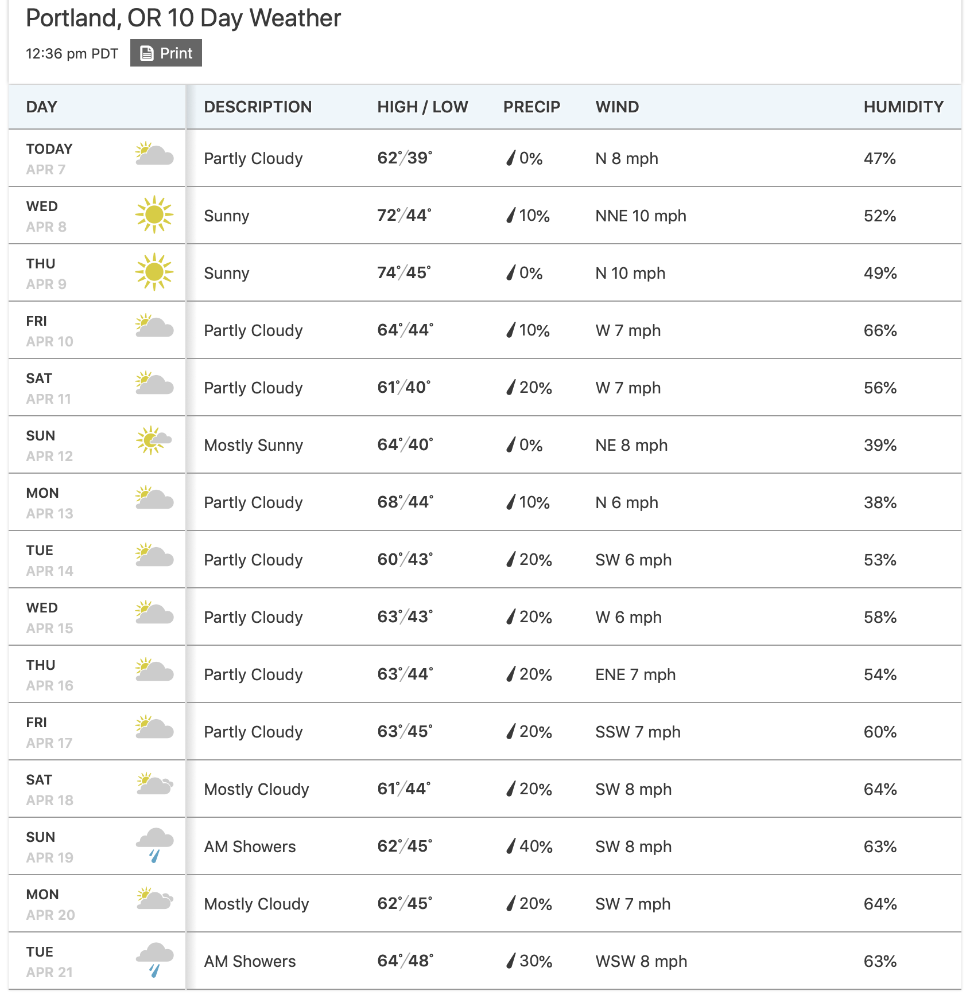

Exercise02
================
Saeah Go
3/28/2022

## Problem Set 1

### Exercise 1

What is the type of the following vectors? Explain why they have that
type.

-   `c(1, NA+1L, "C")`
-   `c(1L / 0, NA)`
-   `c(1:3, 5)`
-   `c(3L, NaN+1L)`
-   `c(NA, TRUE)`

``` r
# your code here for problem set 1 exe 1
typeof(c(1, NA+1L, "C")) # because of "C", the type should be characters
```

    ## [1] "character"

``` r
typeof(c(1L / 0, NA)) # 1L is integer. 1L/0 is infinity(Inf), which is double. NA                         is logical so the type is double
```

    ## [1] "double"

``` r
typeof(c(1:3, 5)) # (1:3) is just 1,2,3 and those are integers, but 5 is double                      since it is not written as 5L. Thus the type should be double
```

    ## [1] "double"

``` r
typeof(c(3L, NaN+1L)) # 3L is integer, but Nan+1L is double since NaN is double.                         Thus the type should be double
```

    ## [1] "double"

``` r
typeof(c(NA, TRUE)) # NA is logical, and TRUE is also logical therefore the type                       is logical
```

    ## [1] "logical"

### Exercise 2

Use the function `paste` (see `?paste`) to create the following
character vectors of length 30:

1.  (“label 1”, “label 2”, ….., “label 30”). Note that there is a single
    space between label and the number following
2.  (“fn1”, “fn2”, …, “fn30”). In this case, there is no space between
    fn and the number following

``` r
# your code here for problem set 1 exe 2
nums <-c(1:30)
paste("label", nums, sep=" ", collapse=", ") # single space btw label and numbers
```

    ## [1] "label 1, label 2, label 3, label 4, label 5, label 6, label 7, label 8, label 9, label 10, label 11, label 12, label 13, label 14, label 15, label 16, label 17, label 18, label 19, label 20, label 21, label 22, label 23, label 24, label 25, label 26, label 27, label 28, label 29, label 30"

``` r
paste("fn", nums, sep="", collapse=", ") # no single space btw fn and numbers
```

    ## [1] "fn1, fn2, fn3, fn4, fn5, fn6, fn7, fn8, fn9, fn10, fn11, fn12, fn13, fn14, fn15, fn16, fn17, fn18, fn19, fn20, fn21, fn22, fn23, fn24, fn25, fn26, fn27, fn28, fn29, fn30"

## Problem Set 2

Build a list to represent the following data in R:

``` json
{
  "firstName": "John",
  "lastName": "Smith",
  "age": 25,
  "address": 
  {
    "streetAddress": "31 3rd Street",
    "city": "New York",
    "state": "NY",
    "postalCode": 10021
  },
  "phoneNumber": 
  [
    {
      "type": "home",
      "number": "212 555-5555"
    },
    {
      "type": "fax",
      "number": "646 555-5555"
    }
  ]
}
```

``` r
# your code here for problem set 2
str(list(firstName = "John", lastName = "Smith", age = 25L, address = list(streetAddress = "31 3rd Street", city = "New York", state = "NY", postalCode = 10021L), phoneNumber = list(type = "home", number = "212 555-5555", type = "fax", number = "646 555-5555")))
```

    ## List of 5
    ##  $ firstName  : chr "John"
    ##  $ lastName   : chr "Smith"
    ##  $ age        : int 25
    ##  $ address    :List of 4
    ##   ..$ streetAddress: chr "31 3rd Street"
    ##   ..$ city         : chr "New York"
    ##   ..$ state        : chr "NY"
    ##   ..$ postalCode   : int 10021
    ##  $ phoneNumber:List of 4
    ##   ..$ type  : chr "home"
    ##   ..$ number: chr "212 555-5555"
    ##   ..$ type  : chr "fax"
    ##   ..$ number: chr "646 555-5555"

## Problem Set 3

Construct a factor variable (without using `factor`, `as.factor`, or
related functions) that contains the weather forecast for Portland over
the next 14 days (i.e., excluding today).

<div class="columns-2">


