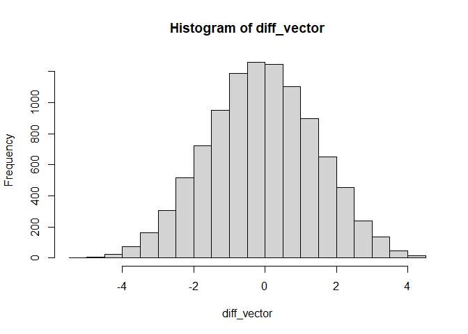

Exercise03
================
Saeah Go
3/28/2022

# Tuesday Lecture: Permutation test for two group means

## Sleep vs Caffeine experiment

In an experiment on memory (Mednicj et al, 2008), students were given
lists of 24 words to memorize. After hearing the words they were
assigned at random to different groups. One group of 12 students took a
nap for 1.5 hours while a second group of 12 students stayed awake and
was given a caffeine pill.

These data contain the number of words each participant was able to
recall after the break:

``` r
Memory <- read.csv("http://www.mosaic-web.org/go/datasets/SleepCaffeine.csv")
```

You want to test whether the data indicate a difference in mean number
of words recalled between the two treatments. Let’s use a *permutation
test* to do so.

## Interlude: Permutation Tests

In testing a null hypothesis we need a test statistic that will have
different values under the *null hypothesis* (the means of the two
groups are the same) and the *alternative hypothesis* we care about
(i.e., the means are different).

To test the hypothesis, we need to know the sampling distribution of the
test statistic when the null hypothesis is true. For some test
statistics and some null hypotheses this is not possible. The p-value
tells us how likely it is (under the null hypothesis) for the test
statistic to be at least as extreme as the one we observed, if the null
hypothesis is true.

Because of this, if the null hypothesis is true, then shuffled data sets
should look like the real data, otherwise they should look different
from the real data. A permutation test gives a simple way to compute the
sampling distribution for any test statistic, under the null hypothesis
that the treatment has absolutely no effect on the outcome, and the
ranking of the real test statistic among the shuffled test statistics
allows us to obtain a p-value.

From the theory, we know that the distribution of a difference in the
means and we could just do a t-test. For the t-test to be valid we need
enough samples so the Central Limit Theorem kicks in. In our case, a
t-test might not work since we have only a few subjects. More
information on permutation tests
[here](http://faculty.washington.edu/kenrice/sisg/SISG-08-06.pdf).

## Questions

1.  Calculate the observed difference (Caffeine-Sleep) between the group
    means

``` r
sleep <- c(mean(Memory[Memory$Group == "Sleep",]$Words)) # the mean of Sleep
caffeine <- c(mean(Memory[Memory$Group == "Caffeine",]$Words)) # the mean of Caffeine
observed_diff = sleep - caffeine
print(observed_diff)
```

    ## [1] 3

2.  Create a function (call it `perm_diff`) to randomly permute the 12
    *Sleep* and 12 *Caffeine* treatment labels and calculate the
    difference for each group under this label assignment

``` r
perm_diff <- function(){
  perm_sample = sample(Memory$Group) 
  sample_smean <- mean(Memory$Words[perm_sample=="Sleep"])
  sample_cmean <- mean(Memory$Words[perm_sample=="Caffeine"])
  return(sample_smean-sample_cmean)
}
perm_diff()
```

    ## [1] -2.333333

3.  Use `perm_diff` to generate 10000 permutations and store the
    difference between the means in a vector called `diff_vector`.

``` r
diff_vector <- rep(0,10000)
for(x in 1:10000){
  diff_vector[x] <- perm_diff()
}
```

4.  Use the function `quantile` with the vector `diff_vector` to see a
    quick summary of the permuted differences

``` r
quantile(diff_vector, probs=c(0.025, 0.5, 0.975))
```

    ##  2.5%   50% 97.5% 
    ##    -3     0     3

5.  Plot the *sampling distribution* of the differences using the
    function `hist`

``` r
hist(diff_vector)
```

<!-- -->

6.  Use the function `abline` to see where the observed difference falls
    in the sampling distribution you plotted above (by default `abline`
    is added to your last plot)

``` r
hist(diff_vector)
abline(v=observed_diff, col = "blue")
```

<!-- -->

7.  Calculate the proportion of times that the observed differences are
    smaller (try greater) than the ones simulated

``` r
# smaller than
mean(observed_diff<diff_vector)
```

    ## [1] 0.02

``` r
# greater than
mean(observed_diff>diff_vector)
```

    ## [1] 0.9737

8.  State you conclusions, is there a difference between the two
    treatments?

**My conclusion is, yes, there is a difference between observed
difference and permutation difference. As we could see through the
histogram, the blue bar(which indicates observed difference) is not that
close to the middle of the histogram.**
