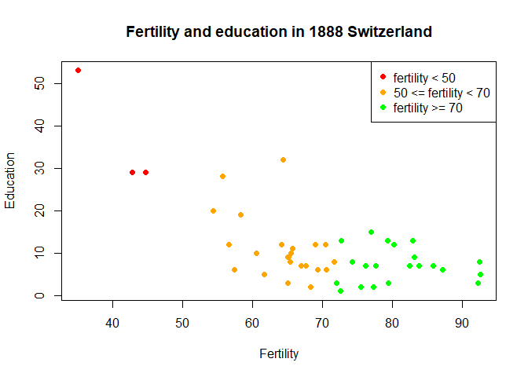

Exercise04
================
Saeah Go
April 20, 2021

# Tuesday Lecture

## Exercise 1

Your task is to play with the `swiss` data set built into R for 20 mins

-   Use `?swiss` to see what things mean in the dataset

-   Load the data using `data(swiss)`

``` r
data(swiss)
str(swiss)
```

    ## 'data.frame':    47 obs. of  6 variables:
    ##  $ Fertility       : num  80.2 83.1 92.5 85.8 76.9 76.1 83.8 92.4 82.4 82.9 ...
    ##  $ Agriculture     : num  17 45.1 39.7 36.5 43.5 35.3 70.2 67.8 53.3 45.2 ...
    ##  $ Examination     : int  15 6 5 12 17 9 16 14 12 16 ...
    ##  $ Education       : int  12 9 5 7 15 7 7 8 7 13 ...
    ##  $ Catholic        : num  9.96 84.84 93.4 33.77 5.16 ...
    ##  $ Infant.Mortality: num  22.2 22.2 20.2 20.3 20.6 26.6 23.6 24.9 21 24.4 ...

-   Think of and write down in your Rmd document one or two questions
    you’d like to explore with these data. For example, some possible
    questions are:

    1.  Is the relationship between education and fertily negative?

    2.  Is this relationship mediated by religious inclination (a
        interaction effect)?

``` r
# your plotting code here!
sorted_swiss <- swiss[order(swiss$Fertility, decreasing = FALSE),] # first re-order the dataset "swiss"
col.fer <- rep(c("red", "orange", "green"), 
               times=c(sum(sorted_swiss$Fertility<50),
                       sum(sorted_swiss$Fertility>=50&swiss$Fertility<70), 
                       sum(sorted_swiss$Fertility>=70)))
plot(x = sorted_swiss$Fertility, y = sorted_swiss$Education,
     xlab = "Fertility", ylab = "Education",
     main = "Fertility and education in 1888 Switzerland",
     col = col.fer,
     cex = 1, 
     type="p",
     pch=16,
     lty=1,
     lwd=1)

legend("topright", 
       bty="y", # made box just for fun
       pch=c(16,16,16),
       col=c("red", "orange", "green"), 
       legend = c("fertility < 50","50 <= fertility < 70","fertility >= 70"))
```

<!-- -->

-   Use the function `plot` to explore your questions and make 2 or 3
    nicely formatted plots with with the options we discussed so far
    (include legends, play with `col`, `cex`, `type`)

## Exercise 2

-   Extend your exploration of swiss by using 2 or three of the figure
    types discussed after plot

-   Make a figure with two panels (1 row by two columns) using mfrow

-   Make a figure with 3 different plots using layout

``` r
par(mfrow=c(1,2))
plot(x = swiss$Fertility, y = swiss$Infant.Mortality,
     main = "Fertility vs. Infant Mortality",
     xlab = "Fertility", ylab = "Infant Mortality",
     type = "p", 
     col = "orange",
     cex = 1,
     cex.main = .9,
     cex.lab = 1,
     cex.axis = 1,
     pch=16,
     lty=1,
     lwd=1)

hist(x = swiss$Agriculture, freq = TRUE, col = "purple", cex.main = .9, main = "Histogram of Agriculture")


nf <- layout(matrix(c(1,2,0,3), ncol=2, nrow=2, byrow=TRUE), widths=c(2,3), heights=c(2,2.5), respect=TRUE)
plot(x = swiss$Fertility, y = swiss$Infant.Mortality,
     main = "Fertility vs. Infant Mortality",
     xlab = "Fertility", ylab = "Infant Mortality",
     type = "p", 
     col = "orange",
     cex = 1,
     cex.main = .9,
     cex.lab = 1,
     cex.axis = 1,
     pch=16,
     lty=1,
     lwd=1)

hist(x = swiss$Agriculture, freq = TRUE, col = "purple", cex.main = .9, main = "Histogram of Agriculture")

matplot(swiss$Infant.Mortality, pch=1:4, col="lightgreen")
```

<!-- -->
