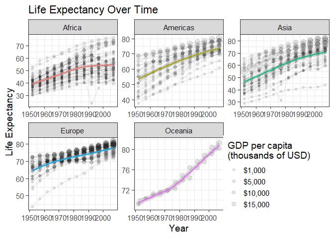
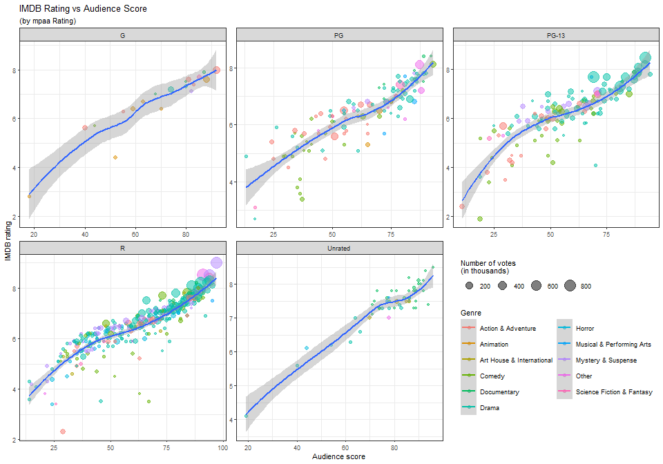

Exercise05
================
Saeah Go
3/28/2022

# Tuesday Lecture: playing with the gapminder data

Explore other relationships in the `gapminder` data using what you
learned today, could be considering other variables in the data set, or
using an alternative geometry or faceting with other variables. Just
make one figure, but using effectively as many of the concepts you
learned as possible.

[This data visualization cheat sheet might be
helpful](https://www.rstudio.com/wp-content/uploads/2016/11/ggplot2-cheatsheet-2.1.pdf)

Here is the data

``` r
data(gapminder)
```



## Thursday Lecture

``` r
moviesdatapath <- "https://raw.githubusercontent.com/mine-cetinkaya-rundel/df2016_workshops/master/viz_ggplot2_shiny/data/movies.csv"
movies = readr::read_csv(url(moviesdatapath))
```

    ## `geom_smooth()` using formula 'y ~ x'



# Thursday Lecture: pipes

Using the `data.frame` below, we want to:

-   Create a crosstabulated table for the first and second `x` and `y`
    (use `table` or `xtabs`)

-   Count the number of cases for each value of `y` (use `table`)

-   Find `mode` among levels of `x` (use `table` combined with `max` and
    `names`)

``` r
library(magrittr)
X <- data.frame(x=sample(c("q","l","m"),50,replace=T),
                y=sample(c("a","b","c"),50,replace=T),
                z=sample(c("c","d","e"),50,replace=T))
str(X)
```

    ## 'data.frame':    50 obs. of  3 variables:
    ##  $ x: chr  "q" "l" "l" "q" ...
    ##  $ y: chr  "c" "c" "c" "c" ...
    ##  $ z: chr  "d" "e" "d" "d" ...

### Let’s do this by:

-   Taking one intermediate step at a time save to same object

``` r
tabs.xy <- X[1:2]
(tabs.xy <- table(tabs.xy))
```

    ##    y
    ## x    a  b  c
    ##   l  6  3  5
    ##   m  7  9  2
    ##   q  4  4 10

``` r
count.y <- X[2]
(count.y <- table(count.y))
```

    ## count.y
    ##  a  b  c 
    ## 17 16 17

``` r
mode.x <- X[1]
mode.x <- table(mode.x)
mode.x <- mode.x == max(mode.x)
(mode.x <- names(mode.x)[mode.x])
```

    ## [1] "m" "q"

-   Using composite functions

``` r
(tabs.xy <- table(X[1:2]))
```

    ##    y
    ## x    a  b  c
    ##   l  6  3  5
    ##   m  7  9  2
    ##   q  4  4 10

``` r
(count.y <- table(X[2]))
```

    ## 
    ##  a  b  c 
    ## 17 16 17

``` r
(count.x <- names(table(X[1]))[table(X[1])==max(table(X[1]))])
```

    ## [1] "m" "q"

-   Using pipes

``` r
X %>% .[1:2] %>% table()
```

    ##    y
    ## x    a  b  c
    ##   l  6  3  5
    ##   m  7  9  2
    ##   q  4  4 10

``` r
X %>% .[1] %>% table() -> cheating1
cheating1 %>% names() %>% .[cheating1==max(cheating1)]
```

    ## [1] "m" "q"
