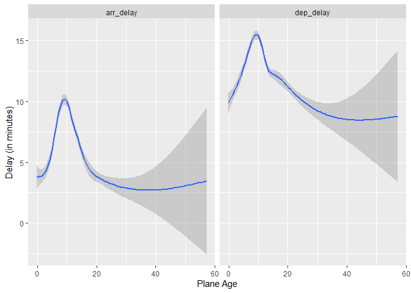

Exercise07
================
Saeah Go
3/28/2022

# Tuesday Lecture

Load up datasets from `nycflights13`

``` r
data(flights)
data(airports)
data(planes)
```

-   Compute the average delay by destination, then join on the airports
    data frame so you can show the spatial distribution of delays. You
    might want to use the size or colour of the points to display the
    average delay for each airport.

``` r
airports %>% 
  semi_join(flights, c("faa" = "dest")) %>% 
  ggplot(aes(lon, lat)) + 
  borders("state") + 
  geom_point() +
  coord_quickmap()
```

<!-- -->

``` r
# compute the average delay by destination
flights %>% 
  group_by(dest) %>% 
  filter(!is.na(arr_delay)) %>% 
  summarise(mean_delay = mean(arr_delay)) %>% 
  left_join(airports, by = c("dest" = "faa")) %>% 
  filter(!is.na(lat) & !is.na(lon)) %>% 
  filter(lon > (-140)) %>% # remove info out of cont US
  # if yes(mean_delay < 0), change to zero / if no(mean_delay >= 0), leave it without changing
  mutate(mean_delay = ifelse(mean_delay < 0, 0, mean_delay)) %>% 
  ggplot(aes(x = lon, y = lat, col = mean_delay, size = mean_delay)) +
  borders("state") + 
  geom_point() + 
  coord_quickmap() + 
  xlab("Longitude") + 
  ylab("Latitude")
```

<!-- -->

-   Add the location of the origin and destination (i.e. the lat and
    lon) to flights.

``` r
flights %>% 
  left_join(airports %>% select(faa, lat, lon),
            by = c("origin" = "faa")) %>%
  left_join(airports %>% select(faa,lat,lon),
            by = c("dest" = "faa"), suffix = c("", " .dest"))
```

    ## # A tibble: 336,776 x 23
    ##     year month   day dep_time sched_dep_time dep_delay arr_time sched_arr_time
    ##    <int> <int> <int>    <int>          <int>     <dbl>    <int>          <int>
    ##  1  2013     1     1      517            515         2      830            819
    ##  2  2013     1     1      533            529         4      850            830
    ##  3  2013     1     1      542            540         2      923            850
    ##  4  2013     1     1      544            545        -1     1004           1022
    ##  5  2013     1     1      554            600        -6      812            837
    ##  6  2013     1     1      554            558        -4      740            728
    ##  7  2013     1     1      555            600        -5      913            854
    ##  8  2013     1     1      557            600        -3      709            723
    ##  9  2013     1     1      557            600        -3      838            846
    ## 10  2013     1     1      558            600        -2      753            745
    ## # ... with 336,766 more rows, and 15 more variables: arr_delay <dbl>,
    ## #   carrier <chr>, flight <int>, tailnum <chr>, origin <chr>, dest <chr>,
    ## #   air_time <dbl>, distance <dbl>, hour <dbl>, minute <dbl>, time_hour <dttm>,
    ## #   lat <dbl>, lon <dbl>, lat .dest <dbl>, lon .dest <dbl>

-   Is there a relationship between the age of a plane and its delays?

``` r
flights %>% select(year, month, day, carrier, tailnum, dep_delay, arr_delay) %>% 
  left_join(planes %>% select(tailnum, year),
            by = "tailnum", suffix = c("", "_built")) %>% 
  mutate(plane_age = (year - year_built)) %>% 
  filter(!is.na(plane_age) & !is.na(dep_delay) &
           !is.na(arr_delay) & dep_delay < 500) %>% #dep_delay < 500 removes extreme outliers
  select(tailnum, dep_delay, arr_delay, plane_age) %>% 
  gather(key = type, value = delay, -c(1,4)) %>% # -c(1,4) changes the order of the table (check columns) 
  ggplot(aes(jitter(plane_age), delay, color = delay)) +
  geom_point(size = 0.2, alpha = 0.1) +
  facet_wrap(type~.) +
  geom_smooth(method = "gam",formula = y ~ s(x, bs = "cs")) +
  xlab("Plane Age") +
  ylab("Delay (in minutes)")
```

<!-- -->

``` r
# without geom_point
flights %>% select(year, month, day, carrier, tailnum, dep_delay, arr_delay) %>%
  left_join(planes %>% select(tailnum, year),
            by = "tailnum", suffix = c("", "_built")) %>%
  mutate(plane_age = (year - year_built)) %>%
  filter(!is.na(plane_age) & !is.na(dep_delay) &
           !is.na(arr_delay) & dep_delay < 500) %>% #dep_delay < 500 removes extreme outliers
  select(tailnum, dep_delay, arr_delay, plane_age) %>%
  gather(key = type, value = delay, -c(1,4)) %>% # -c(1,4) changes the order of the table (check columns)
  ggplot(aes(jitter(plane_age), delay, color = delay)) +
  facet_wrap(type~.) +
  geom_smooth(method = "gam", formula = y ~ s(x, bs = "cs")) +
  xlab("Plane Age") +
  ylab("Delay (in minutes)")
```

<!-- -->

# Thursday Lecture

## Problem 1

1.  Write a function that takes a numeric matrix and transforms each
    column by subtracting by the column mean and dividing by the column
    standard deviation. Use this function on the `state.x77` matrix

``` r
#your code here
library(datasets)

my_fn <- function(the_matrix){
  apply(the_matrix, MARGIN = 2, FUN = function(a_col){
    output = (a_col - mean(a_col))/sd(a_col)
    return(output)
  })
}
my_fn(state.x77)
```

    ##                 Population      Income Illiteracy     Life Exp       Murder
    ## Alabama        -0.14143156 -1.32113867   1.525758 -1.362193670  2.091810096
    ## Alaska         -0.86939802  3.05824562   0.541398 -1.168509784  1.062429318
    ## Arizona        -0.45568908  0.15330286   1.033578 -0.244786635  0.114315444
    ## Arkansas       -0.47853603 -1.72148373   1.197638 -0.162843452  0.737361704
    ## California      3.79697895  1.10371551  -0.114842  0.619341473  0.791539640
    ## Colorado       -0.38199648  0.72940916  -0.771082  0.880069781 -0.156574234
    ## Connecticut    -0.25678625  1.48453153  -0.114842  1.192943751 -1.158866044
    ## Delaware       -0.82146423  0.60735274  -0.442962 -0.609806266 -0.319108041
    ## Florida         0.90280832  0.61711725   0.213278 -0.162843452  0.899895511
    ## Georgia         0.15333885 -0.56113404   1.361698 -1.742112063  1.766742482
    ## Hawaii         -0.75673121  0.85797525   1.197638  2.027274338 -0.319108041
    ## Idaho          -0.76905064 -0.51556631  -0.935142  0.738531557 -0.562908752
    ## Illinois        1.55685818  1.09232357  -0.442962 -0.550211224  0.791539640
    ## Indiana         0.23890291  0.03612870  -0.771082  0.001042913 -0.075307331
    ## Iowa           -0.31031978  0.31278991  -1.099202  1.252538793 -1.375577787
    ## Kansas         -0.44045778  0.37951409  -0.935142  1.267437554 -0.779620494
    ## Kentucky       -0.19250121 -1.17792581   0.705458 -0.580008745  0.872806544
    ## Louisiana      -0.09864953 -1.44970477   2.674178 -1.578225697  1.577119707
    ## Maine          -0.71417317 -1.20721935  -0.771082 -0.363976718 -1.267221915
    ## Maryland       -0.02786880  1.40478801  -0.442962 -0.490616183  0.303938219
    ## Massachusetts   0.35112174  0.51947212  -0.114842  0.708734036 -1.104688108
    ## Michigan        1.08961571  0.51296244  -0.442962 -0.185191593  1.008251383
    ## Minnesota      -0.07289072  0.38927860  -0.935142  1.550514003 -1.375577787
    ## Mississippi    -0.42679441 -2.17716102   2.017938 -2.077334173  1.387496932
    ## Missouri        0.11660455 -0.29586476  -0.607022 -0.140495311  0.520649962
    ## Montana        -0.78405795 -0.14451480  -0.935142 -0.237337254 -0.644175655
    ## Nebraska       -0.60531419  0.11749965  -0.935142  1.282336314 -1.213043980
    ## Nevada         -0.81900034  1.16067517  -1.099202 -1.377092431  1.116607254
    ## New Hampshire  -0.76927463 -0.25192445  -0.771082  0.261771222 -1.104688108
    ## New Jersey      0.69136206  1.30388803  -0.114842  0.038289814 -0.589997719
    ## New Mexico     -0.69491006 -1.35856931   1.689818 -0.416122380  0.629005833
    ## New York        3.09768318  0.76033012   0.377338 -0.244786635  0.954073447
    ## North Carolina  0.26757359 -0.91265653   1.033578 -1.243003587  1.008251383
    ## North Dakota   -0.80847282  1.05977520  -0.607022  1.416425159 -1.619378497
    ## Ohio            1.45337495  0.20375285  -0.607022 -0.043653368  0.005959573
    ## Oklahoma       -0.34302227 -0.73689528  -0.114842  0.403309446 -0.264930105
    ## Oregon         -0.43956182  0.36486732  -0.935142  0.932215443 -0.860887398
    ## Pennsylvania    1.70536334  0.02148193  -0.278902 -0.334179197 -0.346197009
    ## Rhode Island   -0.74261986  0.19887059   0.213278  0.760879698 -1.348488819
    ## South Carolina -0.32039932 -1.30323706   1.853878 -2.174176116  1.143696222
    ## South Dakota   -0.79861728 -0.43745020  -1.099202  0.894968542 -1.538111594
    ## Tennessee      -0.01644532 -1.00053715   0.869518 -0.572559365  0.981162415
    ## Texas           1.78980744 -0.40327441   1.689818  0.015941674  1.306230029
    ## Utah           -0.68169467 -0.67342595  -0.935142  1.505817721 -0.779620494
    ## Vermont        -0.84543112 -0.86057912  -0.935142  0.567195811 -0.508730816
    ## Virginia        0.16453834  0.43159150   0.377338 -0.594907506  0.574827897
    ## Washington     -0.15397498  0.69686078  -0.935142  0.626790853 -0.833798430
    ## West Virginia  -0.54819682 -1.33253061   0.377338 -1.041870320 -0.183663202
    ## Wisconsin       0.07673438  0.05240289  -0.771082  1.192943751 -1.185955012
    ## Wyoming        -0.86693413  0.21188994  -0.935142 -0.438470521 -0.129485266
    ##                    HS Grad       Frost        Area
    ## Alabama        -1.46192933 -1.62482920 -0.23471832
    ## Alaska          1.68280347  0.91456761  5.80934967
    ## Arizona         0.61805142 -1.72101848  0.50020474
    ## Arkansas       -1.63526106 -0.75912574 -0.22022120
    ## California      1.17518912 -1.62482920  1.00349033
    ## Colorado        1.33614002  1.18389757  0.38709909
    ## Connecticut     0.35805383  0.66447550 -0.77201412
    ## Delaware        0.18472210 -0.02808727 -0.80576651
    ## Florida        -0.06289466 -1.79796989 -0.19508270
    ## Georgia        -1.54859519 -0.85531502 -0.14840362
    ## Hawaii          1.08852326 -2.00958630 -0.75369642
    ## Idaho           0.79138315  0.41438339  0.13994490
    ## Illinois       -0.06289466  0.43362124 -0.17565164
    ## Indiana        -0.02575214  0.33743197 -0.40595308
    ## Iowa            0.72947896  0.68371335 -0.17338976
    ## Kansas          0.84090650  0.18352913  0.12951447
    ## Kentucky       -1.80859279 -0.18199010 -0.36431342
    ## Louisiana      -1.35050179 -1.77873204 -0.30243404
    ## Maine           0.19710294  1.08770830 -0.46662534
    ## Maryland       -0.10003717 -0.06656298 -0.71307636
    ## Massachusetts   0.66757477 -0.02808727 -0.73727729
    ## Michigan       -0.03813298  0.39514553 -0.16312341
    ## Minnesota       0.55614723  1.06847045  0.10023896
    ## Mississippi    -1.49907184 -1.04769356 -0.27470552
    ## Missouri       -0.53336649  0.06810201 -0.02040238
    ## Montana         0.75424064  0.97228117  0.87722359
    ## Nebraska        0.76662148  0.66447550  0.06735382
    ## Nevada          1.49709091  1.60713038  0.45885807
    ## New Hampshire   0.55614723  1.33780041 -0.72320207
    ## New Jersey     -0.07527549  0.20276699 -0.74085176
    ## New Mexico      0.25900713  0.29895626  0.59390277
    ## New York       -0.05051382 -0.43208222 -0.26843554
    ## North Carolina -1.80859279 -0.47055792 -0.25710271
    ## North Dakota   -0.34765393  1.56865467 -0.01714434
    ## Ohio            0.01139037  0.37590768 -0.34878497
    ## Oklahoma       -0.18670303 -0.43208222 -0.02289865
    ## Oregon          0.85328734 -1.16312069  0.29824124
    ## Pennsylvania   -0.36003476  0.41438339 -0.30201214
    ## Rhode Island   -0.83050660  0.43362124 -0.81670087
    ## South Carolina -1.89525865 -0.75912574 -0.47477044
    ## South Dakota    0.02377121  1.29932470  0.06116589
    ## Tennessee      -1.40002514 -0.66293647 -0.34464796
    ## Texas          -0.70669822 -1.33626138  2.24310532
    ## Utah            1.75708850  0.62599979  0.13313582
    ## Vermont         0.49424305  1.22237328 -0.72038937
    ## Virginia       -0.65717487 -0.37436865 -0.36278987
    ## Washington      1.28661666 -1.39397495 -0.04882236
    ## West Virginia  -1.42478681 -0.08580083 -0.54690445
    ## Wisconsin       0.17234126  0.85685405 -0.19069958
    ## Wyoming         1.21233164  1.31856256  0.31018349

2.  Combining `apply` and `lapply` write a function to obtain 10
    subsamples of from `state.x77` by selecting 20 rows at random each
    time, and calculate the column means for each of these subsamples.

``` r
#your code here
lapply(1:10, function(X){
  my_sample <- state.x77[sample(nrow(state.x77), 20),]
  apply(my_sample, 2, mean)
})
```

    ## [[1]]
    ## Population     Income Illiteracy   Life Exp     Murder    HS Grad      Frost 
    ##   3501.900   4227.550      1.195     70.934      7.395     52.455    110.650 
    ##       Area 
    ##  72788.700 
    ## 
    ## [[2]]
    ## Population     Income Illiteracy   Life Exp     Murder    HS Grad      Frost 
    ##   2599.150   4498.650      1.170     70.891      6.715     53.055    113.450 
    ##       Area 
    ##  79322.900 
    ## 
    ## [[3]]
    ## Population     Income Illiteracy   Life Exp     Murder    HS Grad      Frost 
    ##  4037.9500  4410.5000     1.2500    70.9685     7.5200    51.6250   108.0500 
    ##       Area 
    ## 74476.0000 
    ## 
    ## [[4]]
    ## Population     Income Illiteracy   Life Exp     Murder    HS Grad      Frost 
    ##  3991.7500  4511.1000     0.9700    71.0765     7.0700    52.9850   114.3000 
    ##       Area 
    ## 67898.9500 
    ## 
    ## [[5]]
    ## Population     Income Illiteracy   Life Exp     Murder    HS Grad      Frost 
    ##   3390.450   4314.100      1.050     70.961      6.350     51.765    115.550 
    ##       Area 
    ##  50918.000 
    ## 
    ## [[6]]
    ## Population     Income Illiteracy   Life Exp     Murder    HS Grad      Frost 
    ##   3648.400   4456.850      1.170     70.873      7.390     52.120    105.450 
    ##       Area 
    ##  62488.200 
    ## 
    ## [[7]]
    ## Population     Income Illiteracy   Life Exp     Murder    HS Grad      Frost 
    ##  4841.9000  4456.8500     1.0500    71.2055     6.4250    54.6700   106.9500 
    ##       Area 
    ## 76400.1000 
    ## 
    ## [[8]]
    ## Population     Income Illiteracy   Life Exp     Murder    HS Grad      Frost 
    ##   2717.400   4483.050      1.210     70.862      7.435     53.650     97.450 
    ##       Area 
    ##  82977.850 
    ## 
    ## [[9]]
    ## Population     Income Illiteracy   Life Exp     Murder    HS Grad      Frost 
    ##  3747.2500  4185.5000     1.2800    70.4715     8.3000    51.6800    94.7000 
    ##       Area 
    ## 59526.8000 
    ## 
    ## [[10]]
    ## Population     Income Illiteracy   Life Exp     Murder    HS Grad      Frost 
    ##  4399.9000  4279.9000     1.1700    70.6875     7.8850    51.5350   109.0500 
    ##       Area 
    ## 55945.0000

3.  In problem 2, replace `lapply` by `sapply`

``` r
#your code here
sapply(1:10, function(X){
  my_sample <- state.x77[sample(nrow(state.x77), 20),]
  apply(my_sample, 2, mean)
})
```

    ##                  [,1]      [,2]      [,3]      [,4]      [,5]      [,6]
    ## Population  5531.1500  4035.150  2290.400  4807.450  2900.850  3744.700
    ## Income      4418.0500  4416.750  4578.100  4373.300  4482.750  4402.800
    ## Illiteracy     1.3400     1.235     1.085     1.045     1.090     1.325
    ## Life Exp      70.4375    70.981    71.062    70.591    71.052    70.486
    ## Murder         8.5300     7.120     6.775     7.280     6.690     8.085
    ## HS Grad       51.5700    52.490    56.350    52.580    55.605    51.700
    ## Frost         99.0000    99.300   115.800   118.850   113.200    94.150
    ## Area       91713.0500 57279.450 90595.300 52759.200 80261.500 86672.450
    ##                  [,7]       [,8]      [,9]      [,10]
    ## Population  4609.2500  3620.7000  3722.100  4438.9500
    ## Income      4400.5000  4507.5000  4446.000  4313.8500
    ## Illiteracy     1.1350     1.2250     1.100     1.2850
    ## Life Exp      70.9125    71.0555    70.874    70.9515
    ## Murder         7.3000     6.9000     7.660     7.7950
    ## HS Grad       54.7300    54.2100    54.655    50.9900
    ## Frost         99.5500   100.6500   113.400    85.0000
    ## Area       58494.9500 90844.7000 89518.400 52294.3000

Fun, let’s do this 1000 times and plot the bootstrap distribution of the
means for each variable.

``` r
#your code here
sapply(1:1000, function(X){
  my_sample <- state.x77[sample(nrow(state.x77), 20),]
  apply(my_sample, 2, mean)
  }) %>% 
  t() %>% # calculate transpose of a matrix of df
  as_tibble() %>% # look more nicely w tibble
  pivot_longer(cols = Population:Area, # pivot_longer makes datasets longer by increasing the # of rows and decreasing the # of columns 
               names_to = "Variable",  # (can check that rows are increased from 1000 to 8000)
               values_to = "Mean") %>% 
  arrange(Variable) %>% 
  ggplot() + 
  geom_density(aes(Mean)) + 
  facet_wrap(Variable~., scales = "free")
```

<!-- -->
