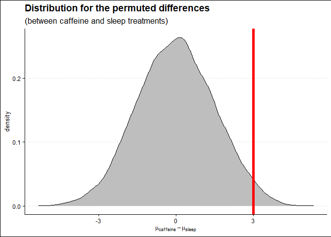

Exercise08
================
Saeah Go
3/28/2022

# Tuesday Lecture

## Problem 1

Let’s use the `got_chars` data set in the `repurrrsive` package

``` r
library(repurrrsive)
```

    ## Warning: package 'repurrrsive' was built under R version 4.0.5

``` r
class(got_chars)
```

    ## [1] "list"

``` r
length(got_chars)
```

    ## [1] 30

``` r
str(got_chars[[1]])
```

    ## List of 18
    ##  $ url        : chr "https://www.anapioficeandfire.com/api/characters/1022"
    ##  $ id         : int 1022
    ##  $ name       : chr "Theon Greyjoy"
    ##  $ gender     : chr "Male"
    ##  $ culture    : chr "Ironborn"
    ##  $ born       : chr "In 278 AC or 279 AC, at Pyke"
    ##  $ died       : chr ""
    ##  $ alive      : logi TRUE
    ##  $ titles     : chr [1:3] "Prince of Winterfell" "Captain of Sea Bitch" "Lord of the Iron Islands (by law of the green lands)"
    ##  $ aliases    : chr [1:4] "Prince of Fools" "Theon Turncloak" "Reek" "Theon Kinslayer"
    ##  $ father     : chr ""
    ##  $ mother     : chr ""
    ##  $ spouse     : chr ""
    ##  $ allegiances: chr "House Greyjoy of Pyke"
    ##  $ books      : chr [1:3] "A Game of Thrones" "A Storm of Swords" "A Feast for Crows"
    ##  $ povBooks   : chr [1:2] "A Clash of Kings" "A Dance with Dragons"
    ##  $ tvSeries   : chr [1:6] "Season 1" "Season 2" "Season 3" "Season 4" ...
    ##  $ playedBy   : chr "Alfie Allen"

1.  Using the appropriate `map` function extract the name of all
    characters in GOT

``` r
#your code here
map_chr(got_chars, "name") 
```

    ##  [1] "Theon Greyjoy"      "Tyrion Lannister"   "Victarion Greyjoy" 
    ##  [4] "Will"               "Areo Hotah"         "Chett"             
    ##  [7] "Cressen"            "Arianne Martell"    "Daenerys Targaryen"
    ## [10] "Davos Seaworth"     "Arya Stark"         "Arys Oakheart"     
    ## [13] "Asha Greyjoy"       "Barristan Selmy"    "Varamyr"           
    ## [16] "Brandon Stark"      "Brienne of Tarth"   "Catelyn Stark"     
    ## [19] "Cersei Lannister"   "Eddard Stark"       "Jaime Lannister"   
    ## [22] "Jon Connington"     "Jon Snow"           "Aeron Greyjoy"     
    ## [25] "Kevan Lannister"    "Melisandre"         "Merrett Frey"      
    ## [28] "Quentyn Martell"    "Samwell Tarly"      "Sansa Stark"

2.  Use `map` to extract for all elements of the list the `id`, `name`
    and `gender`

``` r
#your code here
map(got_chars, `[`, c("id", "name", "gender")) # note that we used backticks(`) to subset
```

    ## [[1]]
    ## [[1]]$id
    ## [1] 1022
    ## 
    ## [[1]]$name
    ## [1] "Theon Greyjoy"
    ## 
    ## [[1]]$gender
    ## [1] "Male"
    ## 
    ## 
    ## [[2]]
    ## [[2]]$id
    ## [1] 1052
    ## 
    ## [[2]]$name
    ## [1] "Tyrion Lannister"
    ## 
    ## [[2]]$gender
    ## [1] "Male"
    ## 
    ## 
    ## [[3]]
    ## [[3]]$id
    ## [1] 1074
    ## 
    ## [[3]]$name
    ## [1] "Victarion Greyjoy"
    ## 
    ## [[3]]$gender
    ## [1] "Male"
    ## 
    ## 
    ## [[4]]
    ## [[4]]$id
    ## [1] 1109
    ## 
    ## [[4]]$name
    ## [1] "Will"
    ## 
    ## [[4]]$gender
    ## [1] "Male"
    ## 
    ## 
    ## [[5]]
    ## [[5]]$id
    ## [1] 1166
    ## 
    ## [[5]]$name
    ## [1] "Areo Hotah"
    ## 
    ## [[5]]$gender
    ## [1] "Male"
    ## 
    ## 
    ## [[6]]
    ## [[6]]$id
    ## [1] 1267
    ## 
    ## [[6]]$name
    ## [1] "Chett"
    ## 
    ## [[6]]$gender
    ## [1] "Male"
    ## 
    ## 
    ## [[7]]
    ## [[7]]$id
    ## [1] 1295
    ## 
    ## [[7]]$name
    ## [1] "Cressen"
    ## 
    ## [[7]]$gender
    ## [1] "Male"
    ## 
    ## 
    ## [[8]]
    ## [[8]]$id
    ## [1] 130
    ## 
    ## [[8]]$name
    ## [1] "Arianne Martell"
    ## 
    ## [[8]]$gender
    ## [1] "Female"
    ## 
    ## 
    ## [[9]]
    ## [[9]]$id
    ## [1] 1303
    ## 
    ## [[9]]$name
    ## [1] "Daenerys Targaryen"
    ## 
    ## [[9]]$gender
    ## [1] "Female"
    ## 
    ## 
    ## [[10]]
    ## [[10]]$id
    ## [1] 1319
    ## 
    ## [[10]]$name
    ## [1] "Davos Seaworth"
    ## 
    ## [[10]]$gender
    ## [1] "Male"
    ## 
    ## 
    ## [[11]]
    ## [[11]]$id
    ## [1] 148
    ## 
    ## [[11]]$name
    ## [1] "Arya Stark"
    ## 
    ## [[11]]$gender
    ## [1] "Female"
    ## 
    ## 
    ## [[12]]
    ## [[12]]$id
    ## [1] 149
    ## 
    ## [[12]]$name
    ## [1] "Arys Oakheart"
    ## 
    ## [[12]]$gender
    ## [1] "Male"
    ## 
    ## 
    ## [[13]]
    ## [[13]]$id
    ## [1] 150
    ## 
    ## [[13]]$name
    ## [1] "Asha Greyjoy"
    ## 
    ## [[13]]$gender
    ## [1] "Female"
    ## 
    ## 
    ## [[14]]
    ## [[14]]$id
    ## [1] 168
    ## 
    ## [[14]]$name
    ## [1] "Barristan Selmy"
    ## 
    ## [[14]]$gender
    ## [1] "Male"
    ## 
    ## 
    ## [[15]]
    ## [[15]]$id
    ## [1] 2066
    ## 
    ## [[15]]$name
    ## [1] "Varamyr"
    ## 
    ## [[15]]$gender
    ## [1] "Male"
    ## 
    ## 
    ## [[16]]
    ## [[16]]$id
    ## [1] 208
    ## 
    ## [[16]]$name
    ## [1] "Brandon Stark"
    ## 
    ## [[16]]$gender
    ## [1] "Male"
    ## 
    ## 
    ## [[17]]
    ## [[17]]$id
    ## [1] 216
    ## 
    ## [[17]]$name
    ## [1] "Brienne of Tarth"
    ## 
    ## [[17]]$gender
    ## [1] "Female"
    ## 
    ## 
    ## [[18]]
    ## [[18]]$id
    ## [1] 232
    ## 
    ## [[18]]$name
    ## [1] "Catelyn Stark"
    ## 
    ## [[18]]$gender
    ## [1] "Female"
    ## 
    ## 
    ## [[19]]
    ## [[19]]$id
    ## [1] 238
    ## 
    ## [[19]]$name
    ## [1] "Cersei Lannister"
    ## 
    ## [[19]]$gender
    ## [1] "Female"
    ## 
    ## 
    ## [[20]]
    ## [[20]]$id
    ## [1] 339
    ## 
    ## [[20]]$name
    ## [1] "Eddard Stark"
    ## 
    ## [[20]]$gender
    ## [1] "Male"
    ## 
    ## 
    ## [[21]]
    ## [[21]]$id
    ## [1] 529
    ## 
    ## [[21]]$name
    ## [1] "Jaime Lannister"
    ## 
    ## [[21]]$gender
    ## [1] "Male"
    ## 
    ## 
    ## [[22]]
    ## [[22]]$id
    ## [1] 576
    ## 
    ## [[22]]$name
    ## [1] "Jon Connington"
    ## 
    ## [[22]]$gender
    ## [1] "Male"
    ## 
    ## 
    ## [[23]]
    ## [[23]]$id
    ## [1] 583
    ## 
    ## [[23]]$name
    ## [1] "Jon Snow"
    ## 
    ## [[23]]$gender
    ## [1] "Male"
    ## 
    ## 
    ## [[24]]
    ## [[24]]$id
    ## [1] 60
    ## 
    ## [[24]]$name
    ## [1] "Aeron Greyjoy"
    ## 
    ## [[24]]$gender
    ## [1] "Male"
    ## 
    ## 
    ## [[25]]
    ## [[25]]$id
    ## [1] 605
    ## 
    ## [[25]]$name
    ## [1] "Kevan Lannister"
    ## 
    ## [[25]]$gender
    ## [1] "Male"
    ## 
    ## 
    ## [[26]]
    ## [[26]]$id
    ## [1] 743
    ## 
    ## [[26]]$name
    ## [1] "Melisandre"
    ## 
    ## [[26]]$gender
    ## [1] "Female"
    ## 
    ## 
    ## [[27]]
    ## [[27]]$id
    ## [1] 751
    ## 
    ## [[27]]$name
    ## [1] "Merrett Frey"
    ## 
    ## [[27]]$gender
    ## [1] "Male"
    ## 
    ## 
    ## [[28]]
    ## [[28]]$id
    ## [1] 844
    ## 
    ## [[28]]$name
    ## [1] "Quentyn Martell"
    ## 
    ## [[28]]$gender
    ## [1] "Male"
    ## 
    ## 
    ## [[29]]
    ## [[29]]$id
    ## [1] 954
    ## 
    ## [[29]]$name
    ## [1] "Samwell Tarly"
    ## 
    ## [[29]]$gender
    ## [1] "Male"
    ## 
    ## 
    ## [[30]]
    ## [[30]]$id
    ## [1] 957
    ## 
    ## [[30]]$name
    ## [1] "Sansa Stark"
    ## 
    ## [[30]]$gender
    ## [1] "Female"

3.  Generate a tidy data frame (tibble) containing the variables `name`,
    `culture`, `gender`, `id`, `born`, `alive` for all characters.

``` r
#your code here
map_df(got_chars, `[`, c("name", "culture", "gender", "id", "born", "alive"))
```

    ## # A tibble: 30 x 6
    ##    name               culture    gender    id born                         alive
    ##    <chr>              <chr>      <chr>  <int> <chr>                        <lgl>
    ##  1 Theon Greyjoy      "Ironborn" Male    1022 "In 278 AC or 279 AC, at Py~ TRUE 
    ##  2 Tyrion Lannister   ""         Male    1052 "In 273 AC, at Casterly Roc~ TRUE 
    ##  3 Victarion Greyjoy  "Ironborn" Male    1074 "In 268 AC or before, at Py~ TRUE 
    ##  4 Will               ""         Male    1109 ""                           FALSE
    ##  5 Areo Hotah         "Norvoshi" Male    1166 "In 257 AC or before, at No~ TRUE 
    ##  6 Chett              ""         Male    1267 "At Hag's Mire"              FALSE
    ##  7 Cressen            ""         Male    1295 "In 219 AC or 220 AC"        FALSE
    ##  8 Arianne Martell    "Dornish"  Female   130 "In 276 AC, at Sunspear"     TRUE 
    ##  9 Daenerys Targaryen "Valyrian" Female  1303 "In 284 AC, at Dragonstone"  TRUE 
    ## 10 Davos Seaworth     "Westeros" Male    1319 "In 260 AC or before, at Ki~ TRUE 
    ## # ... with 20 more rows

## Problem 2

Implement `arg_max()`.

-   **Inputs:** a function and a vector

-   **Output:** the elements of the input where the function returns the
    highest value.

For example: \* `arg_max(-10:5, function(x) x ^ 2)` should return `-10`

-   `arg_max(-5:5, function(x) x ^ 2)` should return `c(-5, 5)`

``` r
#your code here
arg_max <- function(f,x){
  x[f(x) == max(f(x))]
}
arg_max(-10:10, f = function(x)x^2)
```

    ## [1] -10  10

``` r
arg_max(-10:10, f = function(x)sin(x))
```

    ## [1] 8

``` r
sin(-10:10)
```

    ##  [1]  0.5440211 -0.4121185 -0.9893582 -0.6569866  0.2794155  0.9589243
    ##  [7]  0.7568025 -0.1411200 -0.9092974 -0.8414710  0.0000000  0.8414710
    ## [13]  0.9092974  0.1411200 -0.7568025 -0.9589243 -0.2794155  0.6569866
    ## [19]  0.9893582  0.4121185 -0.5440211

## Problem 3

Use reduce() to find all the elements that appear in at least one entry
of the following list

``` r
#your code here
(my.list <- map(1:4, ~ sample(1:10,15, replace = T)))
```

    ## [[1]]
    ##  [1]  2  3  2 10 10  4 10  3  2  9  2  1  6  2  9
    ## 
    ## [[2]]
    ##  [1]  1  8  9  5  8 10  9 10  9 10  7  6  1  2  6
    ## 
    ## [[3]]
    ##  [1] 10  9  5  7  9  8  2  7  2  3  2  4  4  9  2
    ## 
    ## [[4]]
    ##  [1]  6  6 10  5  4  2  9  9  7  2  8  6  2  2  6

``` r
reduce(my.list, union)
```

    ##  [1]  2  3 10  4  9  1  6  8  5  7

``` r
accumulate(my.list, union)
```

    ## [[1]]
    ##  [1]  2  3  2 10 10  4 10  3  2  9  2  1  6  2  9
    ## 
    ## [[2]]
    ##  [1]  2  3 10  4  9  1  6  8  5  7
    ## 
    ## [[3]]
    ##  [1]  2  3 10  4  9  1  6  8  5  7
    ## 
    ## [[4]]
    ##  [1]  2  3 10  4  9  1  6  8  5  7

## Problem 4

Recall the *sleep vs caffeine* experiment? Write the *function factory*
`my.perm.test`, which takes:

1.  a `data.frame`,
2.  the name of the variable with the group labels (assume there are
    only two groups), and
3.  the name of the variable with the values, and

returns the difference between the means of the permuted groups

Use this function to generate 10,000 draws of the permuted differences
for the sleep vs caffeine data found here:

``` r
Memory <- read.csv("http://www.mosaic-web.org/go/datasets/SleepCaffeine.csv")
```

Use as many of the lastest tricks we’ve learned recently as possible.

``` r
#your code here
my_perm_wrap <- function(df, label.var, value.var) {
  function() {
    vv <- sample(1:nrow(df), replace = F)
    perm_labels <- df[[label.var]][vv]
    by(df[[value.var]], perm_labels, mean) %>% diff() # this returns the difference
  }
}

my_perm_test <- my_perm_wrap(Memory, label.var = "Group", value.var = "Words")

vec_of_perm_diffs <- map_dbl(1:10000, ~ my_perm_test())

tibble(differ = vec_of_perm_diffs) %>% 
  ggplot(aes(x = differ)) +
  geom_density(fill = "gray") +
  geom_vline(xintercept = (with(Memory, by(Words, Group, mean)) %>%  diff()),
             color = "red", lwd = 2) +
  xlab(expression(mu[caffeine] - mu[sleep])) + # describe the greek letter mu using expression
  theme_clean() +
  labs(title = "Distribution for the permuted differences",
       subtitle = "(between caffeine and sleep treatments)")
```

<!-- -->

# Thursday Lecture

## Problem 1

We want to get inspections for coffee shops. Let’s say a coffee shop is
anything that has “COFFEE”, “ESPRESSO”, or “ROASTER” in the name. The
regex for this is COFFEE\|ESPRESSO\|ROASTER because \| is a
metacharacter that means “OR”. Use the str\_detect() function, which
returns TRUE if it finds what you’re looking for and FALSE if it doesn’t

``` r
load("data/restaurants_sub.RData")
```

2.  For the following vector of randomly generated names, write a
    regular expression that:

-   detects if the person’s first name starts with a vowel (a,e,i,o,u)

-   detects if the person’s last name starts with a vowel

-   detects if either the person’s first or last name start with a vowel

-   detects if neither the person’s first nor last name start with a
    vowel

``` r
thenames <- c("Jeremy Cruz", "Nathaniel Le", "Jasmine Chu", 
              "Bradley Calderon Raygoza", "Quinten Weller", 
              "Katelien Kanamu-Hauanio", "Zuhriyaa al-Amen", 
              "Travale York", "Alexis Ahmed", "David Alcocer", 
              "Jairo Martinez", "Dwone Gallegos", "Amanda Sherwood", 
              "Hadiyya el-Eid", "Shaimaaa al-Can", "Sarah Love", 
              "Shelby Villano", "Sundus al-Hashmi", "Dyani Loving", 
              "Shanelle Douglas")
```
