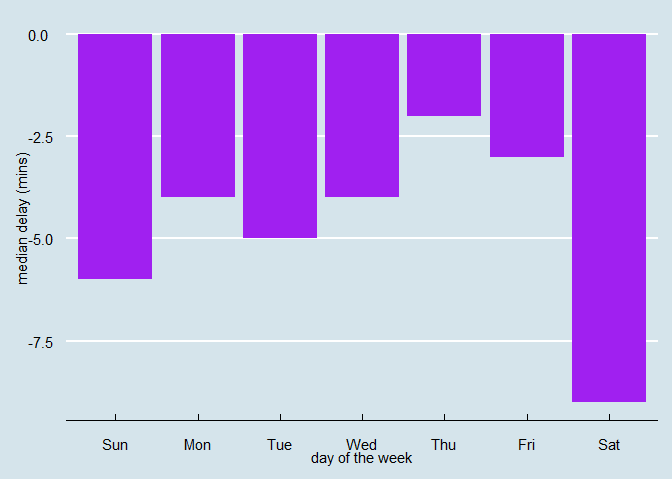
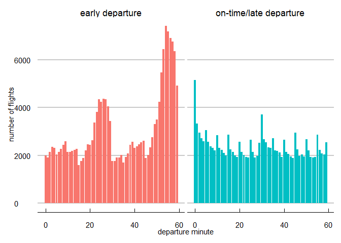

Exercise09
================
Saeah Go
3/28/2022

# Tuesday Lecture

## Problem 1

We want to get inspections for coffee shops. Let’s say a coffee shop is
anything that has “COFFEE”, “ESPRESSO”, or “ROASTER” in the name. The
regex for this is COFFEE\|ESPRESSO\|ROASTER because \| is a
metacharacter that means “OR”. Use the str\_detect() function, which
returns TRUE if it finds what you’re looking for and FALSE if it doesn’t

``` r
load("restaurants_sub.RData")

coffee_data <- restaurants %>% # don't need to do like restaurants <- load("restaurants_sub.Rdata")
  mutate(Name = str_to_upper(Name)) %>% # capitalize Name column
  filter(str_detect(Name, "COFFEE|ESPRESSO|ROASTER")) # find stores including COFFEE ESPRESSO or ROASTER

coffee_data %>% 
  distinct(Name) %>%  # remove duplicate
  head() # see first few rows
```

## Problem 2

For the following vector of randomly generated names, write a regular
expression that:

``` r
thenames <- c("Jeremy Cruz", "Nathaniel Le", "Jasmine Chu", 
              "Bradley Calderon Raygoza", "Quinten Weller", 
              "Katelien Kanamu-Hauanio", "Zuhriyaa al-Amen", 
              "Travale York", "Alexis Ahmed", "David Alcocer", 
              "Jairo Martinez", "Dwone Gallegos", "Amanda Sherwood", 
              "Hadiyya el-Eid", "Shaimaaa al-Can", "Sarah Love", 
              "Shelby Villano", "Sundus al-Hashmi", "Dyani Loving", 
              "Shanelle Douglas")
```

-   detects if the person’s first name starts with a vowel (a,e,i,o,u)

``` r
#First part
str_detect(thenames, "^[aeiouAEIOU]")
```

    ##  [1] FALSE FALSE FALSE FALSE FALSE FALSE FALSE FALSE  TRUE FALSE FALSE FALSE
    ## [13]  TRUE FALSE FALSE FALSE FALSE FALSE FALSE FALSE

``` r
thenames[str_detect(thenames, "^[aeiouAEIOU]")] # can check if I got all the person's name starts with a vowel
```

    ## [1] "Alexis Ahmed"    "Amanda Sherwood"

-   detects if the person’s last name starts with a vowel

``` r
#Second part
# my answer
str_detect(thenames, "\\s\\b[aeiouAEIOU]")
```

    ##  [1] FALSE FALSE FALSE FALSE FALSE FALSE  TRUE FALSE  TRUE  TRUE FALSE FALSE
    ## [13] FALSE  TRUE  TRUE FALSE FALSE  TRUE FALSE FALSE

``` r
thenames[str_detect(thenames, "\\s\\b[aeiouAEIOU]")]
```

    ## [1] "Zuhriyaa al-Amen" "Alexis Ahmed"     "David Alcocer"    "Hadiyya el-Eid"  
    ## [5] "Shaimaaa al-Can"  "Sundus al-Hashmi"

``` r
# professor's answer
thenames[str_detect(thenames, " [aeiouAEIOU]")]
```

    ## [1] "Zuhriyaa al-Amen" "Alexis Ahmed"     "David Alcocer"    "Hadiyya el-Eid"  
    ## [5] "Shaimaaa al-Can"  "Sundus al-Hashmi"

-   detects if either the person’s first or last name start with a vowel

``` r
#Third part (note that both of these will work)
# my answer
str_detect(thenames, "^[aeiouAEIOU]|\\s\\b[aeiouAEIOU]")
```

    ##  [1] FALSE FALSE FALSE FALSE FALSE FALSE  TRUE FALSE  TRUE  TRUE FALSE FALSE
    ## [13]  TRUE  TRUE  TRUE FALSE FALSE  TRUE FALSE FALSE

``` r
thenames[str_detect(thenames, "^[aeiouAEIOU]|\\s\\b[aeiouAEIOU]")]
```

    ## [1] "Zuhriyaa al-Amen" "Alexis Ahmed"     "David Alcocer"    "Amanda Sherwood" 
    ## [5] "Hadiyya el-Eid"   "Shaimaaa al-Can"  "Sundus al-Hashmi"

``` r
# professor's answer
thenames[str_detect(thenames, "^[AEIOU].*| [AEIOUaeiou].*")]
```

    ## [1] "Zuhriyaa al-Amen" "Alexis Ahmed"     "David Alcocer"    "Amanda Sherwood" 
    ## [5] "Hadiyya el-Eid"   "Shaimaaa al-Can"  "Sundus al-Hashmi"

``` r
thenames[str_detect(thenames, "\\b[AEIOU]")]
```

    ## [1] "Zuhriyaa al-Amen" "Alexis Ahmed"     "David Alcocer"    "Amanda Sherwood" 
    ## [5] "Hadiyya el-Eid"

-   detects if neither the person’s first nor last name start with a
    vowel

``` r
#Fourth part  (note that both of these will work)
# my answer
thenames[str_detect(thenames, "^[^[aeiouAEIOU]].*\\s\\b[^aeiouAEIOU].*")] 
```

    ##  [1] "Jeremy Cruz"              "Nathaniel Le"            
    ##  [3] "Jasmine Chu"              "Bradley Calderon Raygoza"
    ##  [5] "Quinten Weller"           "Katelien Kanamu-Hauanio" 
    ##  [7] "Travale York"             "Jairo Martinez"          
    ##  [9] "Dwone Gallegos"           "Sarah Love"              
    ## [11] "Shelby Villano"           "Dyani Loving"            
    ## [13] "Shanelle Douglas"

``` r
# professor's answer
thenames[str_detect(thenames, "^[^AEIOU].* [^aeiouAEIOU].*")] 
```

    ##  [1] "Jeremy Cruz"              "Nathaniel Le"            
    ##  [3] "Jasmine Chu"              "Bradley Calderon Raygoza"
    ##  [5] "Quinten Weller"           "Katelien Kanamu-Hauanio" 
    ##  [7] "Travale York"             "Jairo Martinez"          
    ##  [9] "Dwone Gallegos"           "Sarah Love"              
    ## [11] "Shelby Villano"           "Dyani Loving"            
    ## [13] "Shanelle Douglas"

``` r
thenames[str_detect(thenames, "^[^AEIOU].* [^aeiouAEIOU]-?[^AEIOU]")] 
```

    ##  [1] "Jeremy Cruz"              "Nathaniel Le"            
    ##  [3] "Jasmine Chu"              "Bradley Calderon Raygoza"
    ##  [5] "Quinten Weller"           "Katelien Kanamu-Hauanio" 
    ##  [7] "Travale York"             "Jairo Martinez"          
    ##  [9] "Dwone Gallegos"           "Sarah Love"              
    ## [11] "Shelby Villano"           "Dyani Loving"            
    ## [13] "Shanelle Douglas"

## Problem 3

Consider the following string vector

``` r
text = c("apple","219 733 8965","329-293-8753","Work: (579) 499-7527; Home: (543) 355 3679")
```

-   Write a regular expression that will extract all phone numbers
    contained in the vector above.

``` r
#first part
patt1 <- "\\(?\\d{3}\\)?-? ?\\d{3}-? ?\\d{4}"

str_extract_all(text, patt1)
```

    ## [[1]]
    ## character(0)
    ## 
    ## [[2]]
    ## [1] "219 733 8965"
    ## 
    ## [[3]]
    ## [1] "329-293-8753"
    ## 
    ## [[4]]
    ## [1] "(579) 499-7527" "(543) 355 3679"

-   Once that works use groups to extract only the area code.

``` r
#second part
# first method
str_extract(unlist(str_extract_all(text, patt1)),"(\\d{3})") 
```

    ## [1] "219" "329" "579" "543"

``` r
# second method
patt2 <- "\\(?(\\d{3})\\)?[- ].*?(\\d{3}[- ]\\d{4})\\)?"
map(str_match_all(text, patt2),
    .f = function(x){x[, 2, drop = FALSE]}) %>% 
  unlist()
```

    ## [1] "219" "329" "579" "543"

# Thursday Lecture

## Problem 1

Use the appropriate lubridate function to parse each of the following
dates:

``` r
d1 <- "January 1, 2010"

d2 <- "2015-Mar-07"

d3 <- "06-Jun-2017"

d4 <- c("August 19 (2015)", "July 1 (2015)")

d5 <- "12/30/14" # Dec 30, 2014

d6 <- list("August 19 (2015)", "July 1 (2015)")

mdy(d1)
```

    ## [1] "2010-01-01"

``` r
ymd(d2)
```

    ## [1] "2015-03-07"

``` r
dmy(d3)
```

    ## [1] "2017-06-06"

``` r
mdy(d4)
```

    ## [1] "2015-08-19" "2015-07-01"

``` r
mdy(d5)
```

    ## [1] "2014-12-30"

``` r
mdy(d6)
```

    ## [1] "2015-08-19" "2015-07-01"

## Problem 2

#### On what day of the week should you leave if you want to minimize the chance of a delay?

``` r
library(nycflights13)
make_datetime_100 <- function(year, month, day, time) {
  make_datetime(year, month, day, time %/% 100, time %% 100)
}

flights_dt <- flights %>% 
  mutate(
    dep_time = make_datetime_100(year, month, day, dep_time),
    arr_time = make_datetime_100(year, month, day, arr_time),
    sched_dep_time = make_datetime_100(year, month, day, sched_dep_time),
    sched_arr_time = make_datetime_100(year, month, day, sched_arr_time)) %>% 
  select(origin, dest, ends_with("delay"), ends_with("time")) 

flights_dt %>%  
  mutate(dep_day = wday(dep_time, label = T)) %>% 
  group_by(dep_day) %>% 
  filter(!is.na(arr_delay)) %>% 
  select(arr_delay, dep_day) %>% 
  summarise(avg_delay = median(arr_delay, na.rm = T), n = n()) %>% 
  ggplot(aes(dep_day, avg_delay)) +
  geom_bar(stat = "identity", fill = "purple") +
  xlab("day of the week") + ylab("median delay (mins)") +
  ggthemes::theme_economist()
```

<!-- -->

#### Confirm the hypothesis that the earlier arrivals of flights in minutes 20-30 and 50-60 are caused by scheduled flights that leave early. Hint: create a binary variable that tells you whether or not a flight was delayed.

``` r
#your code here
flights_dt %>% 
  filter(!is.na(arr_delay)) %>% 
  select(arr_delay, dep_time, sched_dep_time) %>% 
  mutate(early_dep = factor(ifelse(dep_time < sched_dep_time, 1, 0),
                            levels = c(1,0),
                            labels = c("early departure", "on-time/late departure")),
         minute = minute(dep_time)) %>% 
  group_by(minute, early_dep) %>% 
  summarise(avg_delay = mean(arr_delay, na.rm = T),
            n = n(),
            .groups = 'drop') %>% # remove warning msg 
  
  ggplot(aes(x = minute, y = n)) +
  geom_bar(stat = "identity", aes(fill = early_dep)) +
  facet_wrap(early_dep~.) +
  xlab("departure minute") +
  ylab("number of flights") +
  ggthemes::theme_economist_white(gray_bg = F) +
  theme(legend.position = "none")
```

<!-- -->
