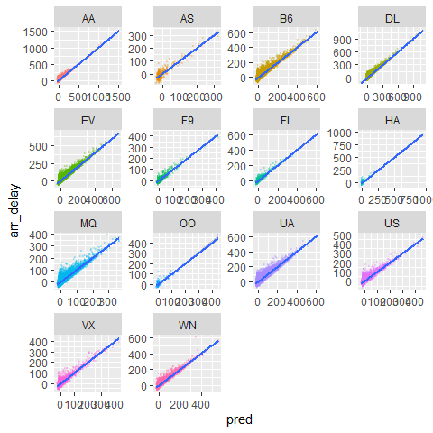

Exercise10
================
Saeah Go
3/28/2022

# Problem 1

Write in `dplyr` and in `data.table` expressions to:

1.  calculate the mean arrival delay and number of flights by carrier,

2.  sort the resulting table by mean delay in descending order, and

3.  keep only those carriers with more than 100 flights

``` r
input <- "https://raw.githubusercontent.com/Rdatatable/data.table/master/vignettes/flights14.csv"
flights <- fread(input) # fread(): to import data from regular delimited files directly into R w/o any detours or nonsense (so, i.e.) sep, nrows are automatically detected)
```

``` r
#dplyr expression here
flights %>% 
  group_by(carrier) %>% 
  summarise(delay = mean(arr_delay),
            n = n()) %>% # count
  arrange(desc(delay)) %>% 
  filter(n > 100)
```

    ## # A tibble: 14 x 3
    ##    carrier delay     n
    ##    <chr>   <dbl> <int>
    ##  1 F9      26.6    473
    ##  2 OO      14.8    200
    ##  3 FL      13.7   1251
    ##  4 EV      13.2  39819
    ##  5 HA      12.4    260
    ##  6 WN      11.2  11902
    ##  7 B6      10.2  44479
    ##  8 MQ       9.50 18559
    ##  9 UA       7.56 46267
    ## 10 AA       5.46 26302
    ## 11 DL       5.16 41683
    ## 12 VX       3.25  4797
    ## 13 US       1.00 16750
    ## 14 AS      -3.89   574

``` r
#data.table expression here
flights[,.(mu_delay = mean(arr_delay),.N), by = carrier
        ][N > 100
          ][order(-mu_delay, N)]
```

    ##     carrier   mu_delay     N
    ##  1:      F9 26.6088795   473
    ##  2:      OO 14.8250000   200
    ##  3:      FL 13.6730616  1251
    ##  4:      EV 13.2214521 39819
    ##  5:      HA 12.4500000   260
    ##  6:      WN 11.2175265 11902
    ##  7:      B6 10.1824681 44479
    ##  8:      MQ  9.4957702 18559
    ##  9:      UA  7.5645276 46267
    ## 10:      AA  5.4635769 26302
    ## 11:      DL  5.1552671 41683
    ## 12:      VX  3.2501563  4797
    ## 13:      US  0.9997612 16750
    ## 14:      AS -3.8885017   574

# Problem 2

### First, write a function called `run.lm` that:

1.  takes in a data set,

2.  fits a regression model to predict arrival delay (`arr_delay`) using
    departure delay `dep_delay` as the sole predictor. To do so use the
    function `lm` (whose arguments are a formula and the data: e.g.,
    `lm(formula=y~x1+x2+x3,data=mydata)` where `y` is the response and
    `x1,x2,x3` explanatory variables, and the data ste is called
    `mydata`), and

3.  returns the fitted values from each model. Note that `lm` returns a
    list and `fitted` is the name of the fitted/predicted values

``` r
# write your run.lm function here
run.lm <- function(data){
  mod <- lm(arr_delay ~ dep_delay, data = data)
  return(mod$fitted)
}
```

### Now, using `data.table`

1.  write a `data.table` expression (using the `.SD` command) to apply
    `run.lm` by `carrier` and return a `data.table` that includes
    `carrier`, `fitted_arr_delay`(the fitted values), and `arr_delay`
    (the observed values)

2.  Plot using any method you like (you can use `ggplot`) for each
    carrier the fitted (x-axis) vs observed values (y-axis)

``` r
# write your data.table expression here
ans <- flights[,.(pred = run.lm(.SD),arr_delay), by = carrier]

ggplot(data = ans, aes(x = pred, y = arr_delay)) +
  geom_point(aes(color = carrier), alpha = 0.2, size = 0.5) +
  geom_smooth(formula = y ~ x, method = "lm") +
  facet_wrap(carrier~., scales = "free") +
  theme(legend.position = "none")
```

<!-- -->
